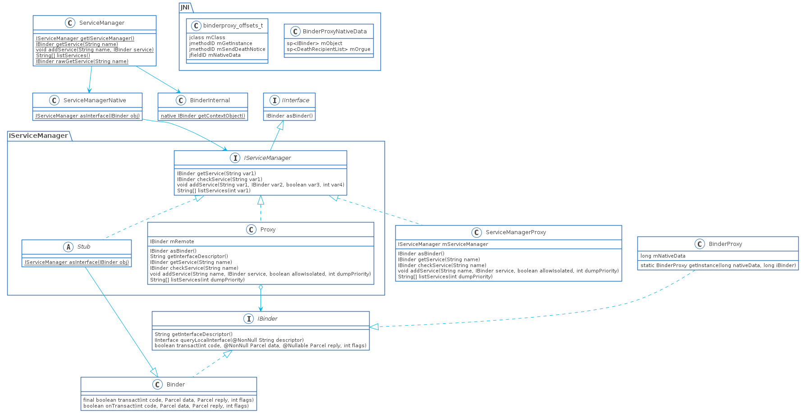

# Binder源码阅读指南

本文内容：

1. 如何获取ServiceManager
2. 为什么可以像调用接口一样调用Binder
3. 添加与获取服务的过程，也是Binder通信的过程
4. 为什么需要Parcel以及Parcelable

> 阅读本文所需知识点：
>
> 1. 进程隔离的概念，需要了解为什么需要IPC
> 2. 什么是用户态和内核态，需要了解IPC实现的机制以及为什么IPC需要内存拷贝
> 3. JNI的作用，JNI可以理解为Java对象与native的通信的协议，它**既可以操作Java对象，又可以操作native的对象**，理解这点很重要
> 4. Java的对象的本质，这点也很重要，因为JNI操作Java对象的时候要理解它在Java虚拟机中的理论模型(与其说是模型，其实展示出来就是一副图像)
>
> 对于1，2两点不清楚的可以阅读《OS: Three easy pieces》，是我看来最好的操作系统原理入门书籍，它厚重的原因是对于概念的解释很详细，专注于虚拟化，并发，文件系统三个方面，而不是大而全
>
> 对于第三点不清楚的可以看一下《深入理解Java虚拟机》这本书，但这一点并非强制要求，在看代码的过程中可以跳过

## Binder的使用

这里以gityuan的代码作为示例

```java
public class ClientDemo {
	public static void main(String[] args) throws RemoteException {
		System.out.println("Client start");
		IBinder binder = ServiceManager.getService("MyService"); //获取名为"MyService"的服务
		IMyService myService = new MyServiceProxy(binder); //创建MyServiceProxy对象
		myService.sayHello("binder"); //通过MyServiceProxy对象调用接口的方法
		System.out.println("Client end");
	}
}
public class ServerDemo {
	public static void main(String[] args) {
		System.out.println("MyService Start");
		Looper.prepareMainLooper(); //开启循环执行
		android.os.Process.setThreadPriority(android.os.Process.THREAD_PRIORITY_FOREGROUND); //设置为前台优先级
		ServiceManager.addService("MyService", new MyService());//注册服务
		Looper.loop();
	}
}
```

## 获取ServiceManager

在`ServerDemo`中可以看到在获取服务之前，先要想ServiceManager添加服务`ServiceManager.addService()`，既然有添加，那必定有一个地方去存储它，存储的地方就是ServiceManager，那么要怎么获取到ServiceManager呢？先从`ServiceManager.addService()`开始，在开始之前先来看一下获取ServiceManager的UML图

### 类图



有几个特殊的类要解释一下

1. BinderProxy，**native binder的存储类**，里面存储的是native binder的指针，并且不是由Java类初始化，是在JNI代码中加载和创建
2. IServiceManager.Stub，这个是个抽象类，没有实现类，在**平常使用Binder的时候一般都是继承它作为Binder实体类，但是IServiceManager是工作在native中的服务，所以Stub类不会被继承**，这种方式也常见于获取C++ Binder服务的时候

### ServiceManager.addService()

最终调用到`addService(String name, IBinder service, boolean allowIsolated, int dumpPriority)`，它里面的代码就一行

```java
getIServiceManager().addService(name, service, allowIsolated, dumpPriority)
```

看到正主`getIServiceManager()`了

### ServiceManager.getIServiceManager()

```java
private static IServiceManager getIServiceManager() {
    if (sServiceManager != null) {
        return sServiceManager;
    }

    // Find the service manager
    sServiceManager = ServiceManagerNative
        .asInterface(Binder.allowBlocking(BinderInternal.getContextObject()));
    return sServiceManager;
}
```

这里使用的是单例模式，没有加线程保护，因为这个接口并不给应用使用，以及应用也不能直接操作`addService()``getService()`等接口，所以`getIServiceManager()`可以是认为运行在主线程中，**没错，我们与ServiceManager的通信也是采用Binder，只是ServiceManager的Binder是有点特殊**，我们先看`ServiceManagerNative.asInterface()`这个方法

### ServiceManagerNative.asInterface()

```java
public static IServiceManager asInterface(IBinder obj) {
    if (obj == null) {
        return null;
    }

    // ServiceManager is never local
    return new ServiceManagerProxy(obj);
}
```

直接创建了一个`ServiceManagerProxy`对象

### ServiceManagerProxy初始化

```java
public ServiceManagerProxy(IBinder remote) {
    mRemote = remote;
    mServiceManager = IServiceManager.Stub.asInterface(remote);
}
```

1. `mRemote = remote;`这个是老的方式，gityuan的[Binder系列7-framework层分析](http://gityuan.com/2015/11/21/binder-framework/#34-smpaddservice)，就是使用这种方
2. `mServiceManager = IServiceManager.Stub.asInterface(remote);`是使用的新的，通过AIDL方式进行通信，显得更加简洁一点

这里说明一点**AIDL并不等于Binder通信，它只是让Binder通信变得更加简单，就如同Retrofit和okhttp的关系**，AIDL生成的java代码在out目录下，所以想要分析的话得要先编译过Android源码才行，具体的路径是`out/soong/.intermediates/frameworks/base/framework-minus-apex/android_common/javac/shard30/classes/android/os/IServiceManager.class`使用AndroidStudio，IDEA或者反编译工具可以打开查看，如果想直接看的话我把它拷贝了一份[IServiceManager.java](https://github.com/TeenagerPeng/aosp-analyze/blob/main/android-R/binder/java/IServiceManager.java)

### IServiceManager.Stub.asInterface()

```java
public static IServiceManager asInterface(IBinder obj) {
    if (obj == null) {
        return null;
    } else {
        IInterface iin = obj.queryLocalInterface("android.os.IServiceManager");
        return (IServiceManager)(iin != null && iin instanceof IServiceManager ? (IServiceManager)iin : new IServiceManager.Stub.Proxy(obj));
    }
}
```

逻辑很简单

1. 如果是相同进程，直接返回Binder对象，由于ServiceManager是单独处于一个进程，这里不会是相同进程，至于本地Service是怎么连接到的，我们稍后再讨论
2. 如果不是相同进程，则创建`IServiceManager.Stub.Proxy`

### IServiceManager.Stub.Proxy初始化

```java
Proxy(IBinder remote) {
    this.mRemote = remote;
}
```

这个和ServiceManagerProxy老的初始化方式是不是一模一样，非常的像，再来看看`IServiceManager.Stub.Proxy.addService()`

```java
public void addService(String name, IBinder service, boolean allowIsolated, int dumpPriority) throws RemoteException {
    Parcel _data = Parcel.obtain();
    Parcel _reply = Parcel.obtain();

    try {
        _data.writeInterfaceToken("android.os.IServiceManager");
        _data.writeString(name);
        _data.writeStrongBinder(service);
        _data.writeInt(allowIsolated ? 1 : 0);
        _data.writeInt(dumpPriority);
        boolean _status = this.mRemote.transact(3, _data, _reply, 0);
        if (!_status && IServiceManager.Stub.getDefaultImpl() != null) {
            IServiceManager.Stub.getDefaultImpl().addService(name, service, allowIsolated, dumpPriority);
            return;
        }

        _reply.readException();
    } finally {
        _reply.recycle();
        _data.recycle();
    }
}
```

和老方式也基本一样，所以新方式只是自动生成了这部分代码，减少了代码量，让IPC看起来就是一个方法调用，但最终都是调用`IBinder.transact()`方法进行IPC，接下来回到`ServiceManager.getIServiceManager()`方法中，上面的只能算作是一些代码技巧而已，接下来就是Binder的核心，获取ServiceManager的`IBinder`对象。

### BinderInternal.getContextObject()

这是一个native方法，对应到`android_util_Binder.cpp`的`android_os_BinderInternal_getContextObject`

### android_os_BinderInternal_getContextObject()

这里做了两件事情：

1. 通过调用`ProcessState.getContextObject(NULL)`获取sp\<IBinder>，注意这里传递的参数NULL，即要获取的是IServiceManager的Binder，这一步留作native Binder解析流程中详细阐述
2. 调用`javaObjectForIBinder()`将IBinder转为java对象，即BinderProxy对象，转换的过程就是将IBinder的指针(long类型)存储在BinderProxy的mNativeData中

### javaObjectForIBinder()

1. 检查是不是Binder类型，这一步

2. 创建BinderProxyNativeData类型的指针,并初始化对应的字段

3. 将其IBinder的智能指针引用放到BinderProxyNativeData.mObject当中

4. 通过`CallStaticObjectMethod()`调用`BinderProxy.getInstance()`并传递对应的参数，这里又引出了一个问题，**我们都知道调用一个类的静态方法是会触发类的加载，可以看到这里直接传的是`gBinderProxyOffsets.mClass`，说明BinderProxy.class对象已经加载完成了，那么这个`gBinderProxyOffsets`又是怎么初始化的呢？**答案是在虚拟机启动的时候就加载完成了，具体的调用栈大致如下

    ```c
    //AndroidRuntime.cpp，这部分是将函数指针进行绑定，使用宏的目的是为了方便DEBUG，可以定义不同的结构体，进行不同的初始化操作
    #define REG_JNI(name)      { name }
    struct RegJNIRec {
        int (*mProc)(JNIEnv*);
    };
    extern int register_android_os_Binder(JNIEnv* env);//申明函数，使用静态链接链入
    static const RegJNIRec gRegJNI[] = {
      ...
    REG_JNI(register_android_os_Binder),//宏展开就是结构体的初始化操作{register_android_os_Binder}
      ...
    };
    //AndroidRuntime.cpp，这部分在进程启动时调用
    AndroidRuntime::start(const char* className, const Vector<String8>& options, bool zygote)
    int AndroidRuntime::startReg(JNIEnv* env)
    static int register_jni_procs(const RegJNIRec array[], size_t count, JNIEnv* env)
    //android_util_Binder.cpp
    int register_android_os_Binder(JNIEnv* env)
    static int int_register_android_os_BinderInternal(JNIEnv* env)
    ```

    

5. 下面的代码没有看懂，但是关系不是很大

如此一来返回的就是`BinderProxy`的对象实例，它也是实现了`IBinder`的接口

### BinderProxy.getInstance()

方法签名如下`private static BinderProxy getInstance(long nativeData, long iBinder)`，是一个私有的静态方法，返回的是BinderProxy的对象实例，再来对比一下`CallStaticObjectMethod(gBinderProxyOffsets.mClass, gBinderProxyOffsets.mGetInstance, (jlong) nativeData, (jlong) val.get())`，应该会觉得很相似。前面两个参数`gBinderProxyOffsets.mClass`和`gBinderProxyOffsets.mGetInstance`代表的分别是BinderProxy.class对象以及getInstance的方法名字，具体的可以看`static int int_register_android_os_BinderProxy(JNIEnv* env)`函数是怎么初始化gBinderProxyOffsets的字段的；后面两个参数就是getInstance的两个参数，将指针转成jlong类型传入到`BinderProxy.getInstance()`当中。接下来看一下getInstance中的逻辑

1. 看看有没有缓存的BinderProxy对象，有则直接返回，这里可以缓存BinderProxy的原因是BinderProxy<==>Binder是一一对应的，所以对于一个Binder服务来说，只需要要一个BinderProxy即可，所以可以是全局的
2. 如果没有，则创建一个BinderProxy实例，并存入到缓存中
3. 之后的BinderProxy的初始化只做了一件事，将传递过来的`BinderProxyNativeData`的指针对应的jlong，存入到mNativeData中，实现了BinderProxy和native binder的关联

以上就是获取IServiceManager整个过程，需要记住一点**就是IServiceManager的所有接口，最终都是调用`BinderProxy.transact()`方法中**

### ServiceManager.addService()

回到最开始添加服务的位置，方法签名如下

```java
public static void addService(String name, IBinder service, boolean allowIsolated,int dumpPriority){
    try {
        getIServiceManager().addService(name, service, allowIsolated, dumpPriority);
    } catch (RemoteException e) {
        Log.e(TAG, "error in addService", e);
    }
}
```

在获取到`IserviceManager`之后的`addService()`则会调用到AIDL生成的方法当中

### IServiceManager.addService()

这个方法的代码在上面有贴出，逻辑如下

1. 获取Parcel对象，分为两种，传递数据的data和获取回复的reply
2. 写入两个String对象，分别是token和服务名称
3. 写入Binder对象，这里我们在下面进行讨论
4. 调用`IBinder.transact()`方法，之前获取IServiceManager的时候就说过返回的是`BinderProxy`的对象实例，所以看`BinderProxy.transact()`方法

### BinderProxy.transact()

1. 判断是不是异步的Binder，这里有个变量`mWarnOnBlocking`，还记得之前在调用`BinderInternal.getContextObject()`之后还做了一个操作`Binder.allowBlocking(BinderInternal.getContextObject())`，这里会将`mWarnOnBloking`置为false，所以这块逻辑一般都是走不到
2. 是否添加Trace，主要是性能跟踪
3. 接下来的一堆操作不是很理解是要干嘛的，最后是调用到`transactNative()`，这是个native方法，方法签名如下`transactNative(int code, Parcel data, Parcel reply, int flags)`

### android_os_BinderProxy_transact()

1. 判断dataObj是否为NULL，所以即使不传任何数据，也要在调用`transact()`之前调用`Parcel.obtain()`获取Parcel对象
2. 将java端的Parcel对象转为native的Parcel，包括data和reply，转换的方式其实和BinderProxy很类似，之后我们再来讨论
3. 之后调用`getBPNativeData()`将`BinderProxy.mNativeData`转为指向`BinderProxyNativeData`的指针，从而获取到sp\<IBinder>
4. 之后调用native 的Binder的`transact()`方法进行，这部分留到native 的解析的时候再说

### IServiceManager.getService()

其实是一样的逻辑，都是通过`BinderProxy.tansact()`进行传递到 JNI再到native binder，包括开头的Demo中客户端调用`sayHello()`向服务进行通信，是不是和`addService()`很像，其中的逻辑是一模一样的。`getService()`和`addService()`唯一区别是对于reply的处理，`getService()`需要获取native传回来的IBinder，我们接下来讨论Parcel的时候看一下

## Parcel和Parceable

### 为什么要Parcelable

这里涉及到对象的深拷贝和浅拷贝，由于java对象都是通过引用来使用的，引用说白了还是指针。问题就在于此，浅拷贝只是将对象中的数据一字节一字节的拷贝，如果对象含有另一对象的引用，就会造成拷贝出来的对象指向同一个对象，这还只是其一，对于远程调用来说，如果只是浅拷贝，拷贝过来的对象中的引用根本就是null(进程的内存隔离)。

解决的方法就是深拷贝，所谓深拷贝就是将对象中引用不断的进行“解析”，怎么“解析”呢？不要忘记了Java中的8个基本类型，所有的java对象都是由这8个基本类型组成，“解析”之后就变成一个个**有序**的字节序列，说它有序是因为“解析”的过程要按照一定的顺序，不然就不能“反解析”了，“反解析“的过程就是将有序的字节序列变成对象的过程，这个“解析”的过程就是序列化，“反解析”的过程就是反序列化

Java中的序列话需要实现Serializeable以及设置一个serialVersionUID，不过由于Serializeable会产生大量的临时对象，所以Android序列化使用的都是Parceable

### Parcel的作用

Parcel作用是将需要传递的所有的对象都序列化，变成有序字节序列(这也是Parceable的createFromParcel()和writeToParcel()写入顺序和读取顺序不能乱的原因)，传递给Binder驱动，然后从Binder驱动读取数据，反序列化成对象，返回给调用者或者等待者。Parcel支持的类型大致如下：

1. Java的6种基本类型，除了char和short，没有看到这两个的接口，之外都支持
2. String或者CharSequence
3. Parceable的对象
4. Binder对象
5. 一些常见的集合类和上述类型的数组

### Parcel.writeInt()

`writeByte()`,`writeBoolean()`这两种类型最终调用的也是`writeInt()`，以这个方法为例，看一下Parcel的过程，`writeInt()`直接调用了`nativeWriteInt()`方法

### android_os_Parcel_writeInt()

这个方法在`android_os_Parcel.cpp`中，直接将native Parcel对象的指针转换过来，调用`writeInt32()`将值写入，这里是由于Java中的int都是有符号的32位整数，于是这里引出了一个问题，这个`Parcel`对象是怎么初始化的？回顾一下前面Parcel对象是咋获取的`Parcel data = Parcel.obain()`

### Parcel.obtain()

1. 看一下缓存池里面有没有Parcel对象，如果有则返回
2. 如果没有则创建一个新的Parcel对象返回

### Parcel构造方法

里面就一句代码`init(nativePtr);`

### Parcel.init()

这里的方法签名如下`private void init(long nativePtr)`，需要传一个参数nativePtr，在构造方法中传的是0，所以相当于空指针，所以走的是else的流程

```java
private void init(long nativePtr) {
    if (nativePtr != 0) {
        mNativePtr = nativePtr;
        mOwnsNativeParcelObject = false;
    } else {
        mNativePtr = nativeCreate();
        mOwnsNativeParcelObject = true;
    }
}
```

### android_os_Parcel_create()

`nativeCreate()`对应到`android_os_Parcel.cpp`中的`static jlong android_os_Parcel_create(JNIEnv* env, jclass clazz)`，很简单的一句话，创建了一个Parcel对象，并且将指针转为了jlong类型返回，没有初始化任何东西

### Parcel的一些问题

1. 为什么可以支持集合类

    可以将集合看成数组，只要前面加一个标志，然后遇到这个标志就读取集合的大小，然后根据大小一个一个读取元素

2. 为什么Parcel可以写入IBinder(`writeStrongBinder()`)，IBinder既不是Parcelable也不是基础类型，也不是Parcelable对象

    这里有个之前没有提到的知识点，那就是Binder服务是什么，它在native对应又是个什么东西，接下来再分析一下

### Parcel.writeStrongBinder()


