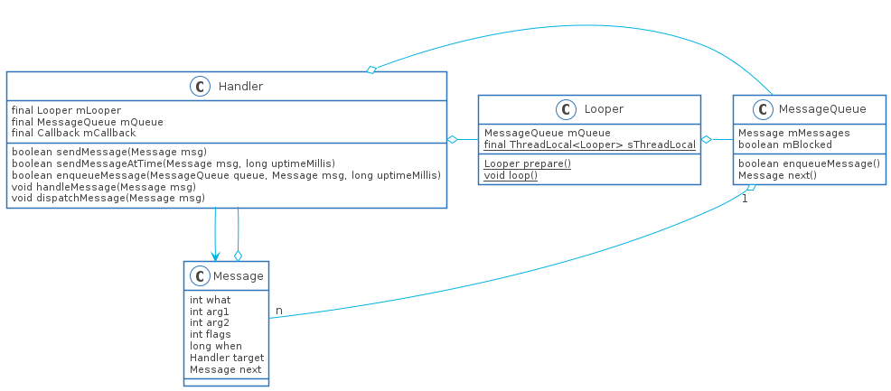

# Handler源码阅读指南

本文内容：

1. Handler相关问题
2. Handler发送消息流程
3. Handler处理消息流程
4. 异步消息与同步屏障
5. IdleHandler

## Handler的相关问题

1. Handler线程通信机制的原理？
2. 一个线程中最多有多少个Handler，Looper，MessageQueue？
3. Looper死循环为什么不会导致应用卡死，会耗费大量资源吗？
4. Looper阻塞之后谁来唤醒它，哪些情况会唤醒Looper线程？
5. Handler的消息优先级？

## Handler通信机制的原理

Handler通信机制的核心其实是**生产者消费者模型**，如何理解这个模型，举个很简单真实世界的例子：假如很多人在超市买东西(**生产者**，这里产生的是账单)，买完东西就会产生一个账单(**消息**)，再假设只有一个收银员(**消费者**，由收银员结账消费账单)，这时候就会出现排队结账的现象(**消息队列**)。当有买完东西要结账的时候(**产生一个消息**)，收银员就要对这些账单进行一个一个的进行结账(**消费消息**)，当没有人要结账的时候(**消息队列为空**)，收银员就可以休息了(**线程睡眠**)。

这是一种非常常见的模型，通常用于多个线程进行生产(可能很耗时)，一个线程进行消费掉(不是特别耗时)。而Handler就是这种模型的典型应用，那Handler中对应的角色呢

## Handler中的角色

从上面生产者消费者模型可以看出这个模型有四个角色

1. 生产者，即产生消息的角色，对应就是`Handler`，产生消息的过程就是`Handler.sendMessage()`方法
2. 消费者，即消费消息的角色，对应的是`Looper`，消费消息的过程就是调用`Looper.loop()`方法
3. 消息，对应就是`Message`
4. 消息队列，对应就是`MessageQueue`

接下来我们就可以回答两个问题了

1. 一个线程中最多有多少个Handler，Looper，MessageQueue？

    答：一个线程中可以有n个Handler(生产者可以有多个)，但是Looper(消费者)和MessageQueue(消息队列)只会有一个

2. Looper死循环为什么不会导致应用卡死，会耗费大量资源吗？

    答：因为消息队列为空的时候，Looper线程会进行阻塞，直到有合乎条件的消息产生

## Handler的类图



## Handler发送消息流程

在查看发送消息流程先来看一下Handler使用

```java
Handler handler;
new Thread(()->{
    Looper.prepare();
    handler = new Handler(){
        @Override
        public void handleMessage(Message msg) {}
    };
    notifyAll();
    Looper.loop();
}).start();
while (null == handler) {
    try {
        wait();
    } catch (InterruptedException e) {
    }
}
handler.sendEmptyMessage(0);
```

给子线程发送一个消息看起来很难吧，当然还有比较简单的方法就是用HandlerThread，简化了子线程创建Handler的麻烦，这里是为了说明Handler创建

```java
HandlerThread thread = new HandlerThread("thread-0");
thread.start();
Handler handler = new Handler(thread.getLooper());
handler.sendEmptyMessage(0);
```

### Looper.prepare()

这是一个Looper对象创建的方法，里面很简单，创建Looper对象，并将引用设置sThreadLocal中，sThreadLocal中存储的是线程和Looper引用的键值对，它是一个常量，意味着sThreadLocal在进程结束之前都不会销毁

### Looper初始化(消费者)

在构造方法中创建消息队列MessageQueue

### MessageQueue初始化(消息队列)

在构造方法中对native层的Handler和Looper进行初始化

### Handler初始化(生产者)

1. 尝试通过调用`Looper.myLooper()`获取当前线程的Looper对象，如果获取不到，则说明没有进行创建，抛出运行时异常
2. 通过Looper对象获取消息队列MessageQueue
3. 对于参数async，可以将其标记为该Handler(生产者)是VIP即可，优先处理他们的消息，VIP不开放给开发者使用

### Handler.enqueueMessage()

1. 设置Message的target对象为当前Handler，方便后面Looper获取到消息之后知道给谁用
2. 

