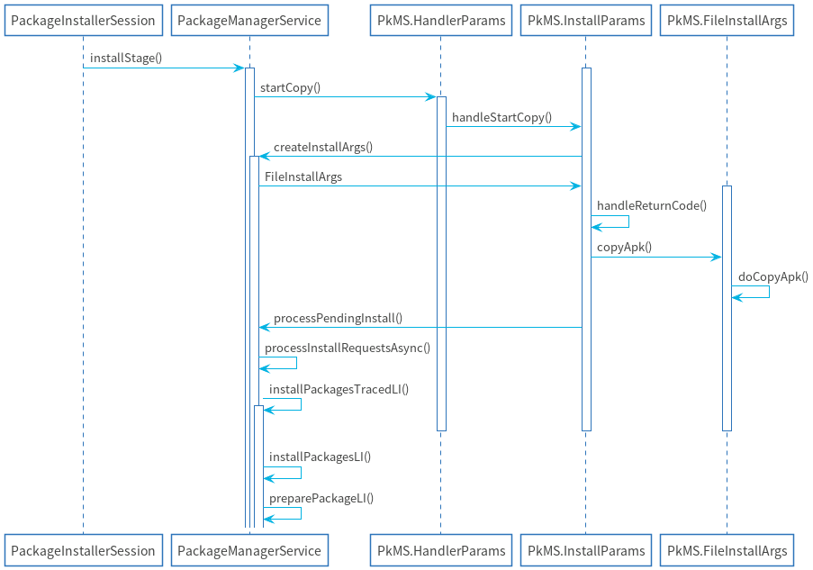

# 应用安装源码阅读指南（下）

> 应用安装源码阅读指南（上）是从PackageInstaller到PackageInstallerService，主要的作用是拷贝apk以及处理安装的参数，本篇则会讲述应用是如何安装到系统中

## UML图

## installStage()

1. 将传入的`ActiveInstallSession`转为`InstallParams`
2. 发送一个`INIT_COPY`消息给安装线程，因为安装应用也是涉及到IO操作，这一步最后是调用到`HandlerParams.startCopy()`，这里有个小注意的点是`InstallParams extends HandlerParams`

## HandlerParams.startCopy()

调用了两个抽象方法，`handleStartCopy()`和`handleReturnCode()`，因为InstallParams是继承自HandlerParams，所以是分别调用到`InstallParams.handleStartCopy()`和`InstallParams.handleReturnCode()`

## InstallParams.handleStartCopy()

1. 调用`PackageManagerServiceUtils.getMinimalPackageInfo`获取PackageLiteInfo，主要是manifest下的一些标签
2. 如果存储空间不足，则尝试释放一些缓存尝试安装
3. 判断`origin.existing`，如果不存在则需要调用`sendIntegrityVerificationRequest()`和`sendPackageVerificationRequest()`给应用商店验证是否有异常信息，这里基本都是要检测的，除非是系统内部移动package
4. 判断是否是回滚版本，如果是要回滚版本则需要发送一个广播，这个广播用来干嘛的暂时也是未知

## InstallParams.handleReturnCode()

1. 这里有三个条件同时满足`mVerificationCompleted，mVerificationCompleted，mEnableRollbackCompleted`才可以进入安装，所以一开始是不会进入，一般调用栈是从`handleVerificationFinished()`或者是`handleIntegrityVerificationFinished()`
2. 调用`FileInstallArgs.copyApk()`这步会判断有没有之前有没有创建临时文件夹，如果没有就需要将apk拷贝到data/app目录
3. 调用`processPendingInstall()`进入下一个阶段

## processPendingInstall()

直接调用`processInstallRequestsAsync()`

## processInstallRequestsAsync()

1. 判断`success`，如果不成功则不会进行安装
2. 依次调用`FileInstallArgs.doPreInstall()`，`installPackagesTracedLI()`，`FileInstallArgs.doPostInstall()`，`FileInstallArgs.doPreInstall()`和`FileInstallArgs.doPostInstall()`并没有做什么工作，最主要的安装工作还是交给了`installPackagesTracedLI()`
3. 调用`restoreAndPostInstall()`将安装结果发送给监听者

## installPackagesTracedLI()

直接调用`installPackagesLI()`

## installPackagesLI()

这个方法是安装最主要的部分，分为主要三个阶段，准备，扫描，和提交。

1. 准备阶段就是解析Package，然后生成对应的数据结构
2. 扫描阶段是生成Package在系统中的属性，例如：uid，code位置，确定真正的包名，确定sharedUserId等等
3. 提交阶段主要就是申请权限，以及将属性缓存在xml中，方便下次开机的时候获取

接下来看一下具体的流程

1. 参数，可以看到一开始就建立了很多Map，其实这里无需关注，只有当我们要批量安装加了--multipackage参数的时候才可能会出现，这里可以假设InstallRequest列表中就一个
2. 调用`preparePackageLI()`获取解析之后的PrepareResult
3. 调用`scanPackageTracedLI()`获取扫描之后的结果ScanResult
4. 调用`reconcilePackagesLocked()`做一些一致性的处理
5. 调用`commitPackagesLocked()`将属性进行缓存到xml并申请权限
6. 调用`executePostCommitSteps()`创建app的目录以及做dex的优化工作

## preparePackageLI()

1. 确定scanFlags和parseFlags
2. 调用`PackageParser2.parsePackage()`进行扫描apk
3. 调用`ParsingPackageUtils.getSigningDetails()`获取apk的签名，当然，如果是安装应用会在之前PackageInstallerSession中获取签名
4. 判断是否存在已安装应用，如果有，则需要进行签名验证或者更新签名，更新签名需要老的package包含，首先是检测之前安装的应用是否匹配，另外还要检测sharedUserId的应用是否匹配签名，不过不知道为何要在这校验签名，因为之后在`reconcilePackagesLocked()`也会进行校验
5. 处理定义的权限，具体处理的逻辑可以不看，也不大能看懂，主要看抛出的异常是什么，基本可以确定是对重复定义的权限以及覆盖系统权限的一些权限进行检查
6. 判断`FileInstallArgs.move`，然后设置应用abi(application binary interface)，abi主要指的是二进制文件执行的架构，x86,arm这些或者32位64位系统
7. 调用`FileInstallArgs.doRename()`，这里才是真正生成应用目录的地方，在Android11中应该是类似的目录结构`/data/app/~~JfQyWVYLzBkOPnXEZp9YhQ==/com.example.anrdemo-lIG1Gajd9XweYWfdp7eYrw==/base.apk`
8. 调用`freezePackageForInstall()`向AMS发送停止应用，或者如果安装的时候带有`DELETE_DONT_KILL_APP`可以不杀死进程
9. 整理`PrepareResult`的属性

### PackageParser2.parsePackage()

详细逻辑见[PkMS解析package指南](https://juejin.cn/post/6941298492174729224#heading-13)

### ParsingPackageUtils.getSigningDetails()

详细的逻辑见[APK 签名方案 v2 验证](https://source.android.google.cn/security/apksigning/v2?hl=zh-cn#v2-verification)

### FileInstallArgs.doRename()

1. 调用`getNextCodePath()`生成新的apk目录，需要注意的是codeFile其实是代码的目录，并不是具体到apk当中
2. `Os.rename()`将旧的代码目录变成新的代码目录，举个例子，原本是`/data/app/vmdl218208396.tmp`经过rename之后就变成`/data/app/~~tJDAn7WYw1ddEHvCsow0fw==/com.example.anrdemo-nan3xIC6pBnBLiej4517eQ==`不知道为什么要设置两层目录，Android Q中只有一层，没有后面带包名的那一层

## scanPackageTracedLI()

直接调用`scanPackageNewLI()`方法，`scanPackageNewLI()`详细逻辑见[Android 开机应用扫描指南](https://juejin.cn/post/6963828909460684830#heading-6)

## optimisticallyRegisterAppId()

使用这个方法为应用申请uid，之后一路调用到`acquireAndRegisterNewAppIdLPw()`，所有的uid都放在一个mAppIds的ArrayList下面，分配的规则如下：

1. 看一下mAppIds中有没有没被占用的，可以尽量的让空间紧凑，因为安装应用最大也就10000个
2. 如果都占满了，新增一个

## reconcilePackagesLocked()

1. 判断是不是已安装的应用，如果是则需要先调用`mayDeletePackageLocked()`构造需要卸载的应用参数，准备卸载已安装的应用
2. 再次校验签名，不知道为什么要在`preparePackageLI()`中校验一次签名
3. 构建`ReconciledPackage`
4. 收集SharedLibrary，可以理解为共享jar包，是虚拟机预先加载过的jar包，最常见的就是framework.jar，其次就是应用使用比较多的httpclient库。SharedLibrary分为三种
   1. uses-library标签，required=true，对应在AndroidPackage的接口就是`getUsesLibraries()`
   2. uses-library标签，required=true，对应是`getUsesOptionalLibraries()`，这种用的是最多的，可以参考微信的AndroidManifest.xml
   3. uses-static-library标签，这种标签目前还没见到人用过`getUsesStaticLibraries()`

## commitPackagesLocked()

1. 判断是覆盖安装还是新增，如果是覆盖安装，继续判断是不是系统应用
   1. 如果是系统应用，则调用`disableSystemPackageLPw()`
   2. 如果不是，则调用`executeDeletePackageLIF()`卸载旧应用
2. 调用`commitReconciledScanResultLocked()`进行继续更新应用在系统中的信息
3. 调用`updateSettingsLI()`将应用信息缓存，这样就不用在下次开机的时候scan了，直接读取即可

### commitReconciledScanResultLocked()

详细逻辑见[commitReconciledScanResultLocked()](https://juejin.cn/post/6963828909460684830#heading-9)

### updateSettingsLI()

直接调用的`updateSettingsInternalLI()`

### updateSettingsInternalLI()

1. 调用`PermissionManagerService.updatePermissions()`，申请权限，这里安装权限和覆盖安装时之前申请了的运行时权限
2. 如果覆盖安装的系统应用，则需要更新一些状态，系统应用如果没有特殊情况，都是为所有用户安装的
   1. enable所有用户的当前应用
   2. 设置系统应用的当前状态
   3. 重置应用的图标
3. 更新overlay的动态库信息
4. 调用`Settings.writeLPr()`更新应用信息到xml中，具体的位置在`/data/system/packages.xml`，这里有个比较有趣的地方是，每一次安装应用都是全写，而不是增量更新，是因为应用数量不多还是为什么不太清楚

## executePostCommitSteps()

这部分的操作基本都与C++层Installer相关了

1. 调用`prepareAppDataAfterInstallLIF()`创建应用内部存储，比如sharedPreference, sqlite db文件就是存在这个目录当中，开发者应当比较熟悉
2. 调用`PackageDexOptimizer.performDexOpt.performDexOpt()`进行初步优化
3. 调用`notifyPackageChangeObserversOnUpdate()`通知native层的进程应用安装变化

# 总结

以上就是应用安装的全过程，并没有很高深的代码，但是业务逻辑也是相当相当的复杂，需要很强的这方面的经验才能看懂代码的意思，很多代码的设计只有遇到问题的时候才知道为什么这样写，当然，我研究PkMS不过短短一年多的时间，很多代码我也没有看懂，里面凡是我跳过的逻辑以及包含*处理*或者一些含糊不清的动词，基本上这块的逻辑我是没有搞透彻的。还有一些剩余的源码分析的内容没有弄清楚

1. 签名的源码，原理我知道的差不多，但是从原理转换到源码的过程还是差的远，这里列举一下签名的理论的几个文档
   1. [摘要、签名与数字证书都是什么？](https://www.jianshu.com/p/b2774634041a)
   2. [Android 端 V1/V2/V3 签名的原理](https://zhuanlan.zhihu.com/p/108034286)
   3. [APK 签名方案 v2](https://source.android.google.cn/security/apksigning/v2?hl=zh-cn)
2. Permission这块的东西还没来得及研究，但是应该不算复杂，因为PermissionManagerService算是PkMS的一个子模块，比较要研究的反而是AppOpsManager，这块东西目前我都不知道它是干嘛的，和Permission的区别是什么
3. dex2oat的优化工作，这部分的原理还没搞清楚，发现dex相关的书籍和文章还是太少了

