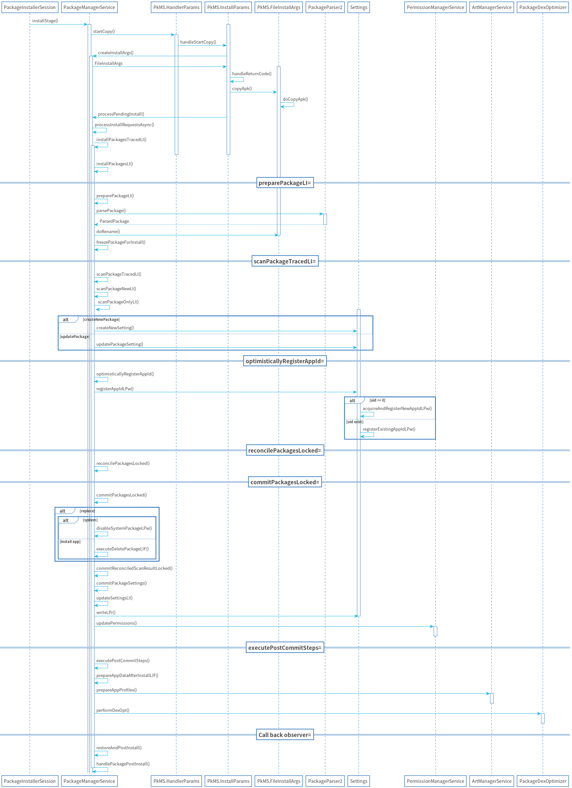

# 应用安装源码阅读指南（下）

> 应用安装源码阅读指南（上）是从PackageInstaller到PackageInstallerService，主要的作用是拷贝apk以及处理安装的参数，本篇则会讲述应用是如何安装到系统中

## UML图

## installStage()

1. 将传入的`ActiveInstallSession`转为`InstallParams`
2. 发送一个`INIT_COPY`消息给安装线程，因为安装应用也是涉及到IO操作，这一步最后是调用到`HandlerParams.startCopy()`，这里有个小注意的点是`InstallParams extends HandlerParams`

## HandlerParams.startCopy()

调用了两个抽象方法，`handleStartCopy()`和`handleReturnCode()`，因为InstallParams是继承自HandlerParams，所以是分别调用到`InstallParams.handleStartCopy()`和`InstallParams.handleReturnCode()`

## InstallParams.handleStartCopy()

1. 调用`PackageManagerServiceUtils.getMinimalPackageInfo`获取PackageLiteInfo，主要是manifest下的一些标签
2. 如果存储空间不足，则尝试释放一些缓存尝试安装
3. 判断`origin.existing`，如果不存在则需要调用`sendIntegrityVerificationRequest()`和`sendPackageVerificationRequest()`给应用商店验证是否有异常信息，这里基本都是要检测的，除非是系统内部移动package
4. 判断是否是回滚版本，如果是要回滚版本则需要发送一个广播，这个广播用来干嘛的暂时也是未知

## InstallParams.handleReturnCode()

1. 这里有三个条件同时满足`mVerificationCompleted，mVerificationCompleted，mEnableRollbackCompleted`才可以进入安装，所以一开始是不会进入，一般调用栈是从`handleVerificationFinished()`或者是`handleIntegrityVerificationFinished()`
2. 调用`FileInstallArgs.copyApk()`这步会判断有没有之前有没有创建临时文件夹，如果没有就需要将apk拷贝到data/app目录
3. 调用`processPendingInstall()`进入下一个阶段

## processPendingInstall()

直接调用`processInstallRequestsAsync()`

## processInstallRequestsAsync()

1. 判断`success`，如果不成功则不会进行安装
2. 依次调用`FileInstallArgs.doPreInstall()`，`installPackagesTracedLI()`，`FileInstallArgs.doPostInstall()`，`FileInstallArgs.doPreInstall()`和`FileInstallArgs.doPostInstall()`并没有做什么工作，最主要的安装工作还是交给了`installPackagesTracedLI()`
3. 调用`restoreAndPostInstall()`将安装结果发送给监听者

## installPackagesTracedLI()

直接调用`installPackagesLI()`

## installPackagesLI()

这个方法很长，分为主要三个阶段，准备，扫描，和提交，