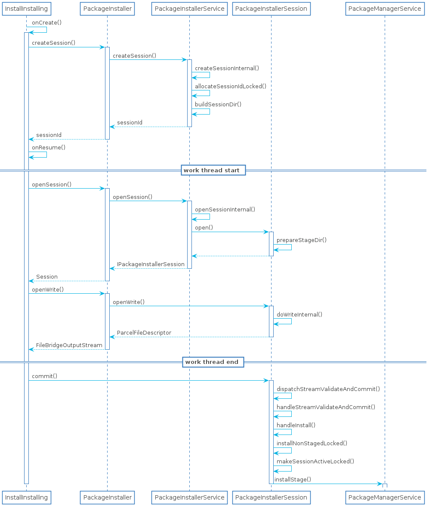

# 应用安装源码阅读指南（上）

> 前一篇[Android 开机应用扫描指南](https://juejin.cn/post/6963828909460684830)其实专注的是系统应用的安装，有一些安装的细节忽略掉了。而应用安装的部分则要更加复杂一些，由于应用安装的源码过程很长，所以分为三个部分，第一部分是从安装界面到安装服务，第二部分则是说一下AppBundle相关的逻辑，第三部分则集中在PackageManagerService中

## UML时序图

从时序图中看安装过程对Session的处理分为三个部分

1. 创建Session
2. 以Session为单位拷贝文件到一个临时目录中
3. 终止拷贝，提交给PackageManagerService解析和扫描

## IntallInstalling.onCreate()

当用户点击文件夹中apk进行安装时(前提是文件管理应用已获取到安装应用的权限)会经过三个界面，分别是PackageInstallerActivity(是否确认安装)、InstallInstalling(安装进度条)、InstallSuccess(显示完成、打开)，我们着重看一下InstallInstalling的逻辑，这部分才是和安装服务有交互的

在`onCreate()`中，最重要的逻辑便是创建Session，安装服务安装应用是以Session为单位的，这样做的目的主要就是为了AppBundle服务，可以一次性安装多个apk，接下来看一下onCreate()的逻辑

1. 调用`Intent.getData()`获取应用的URI，一般都是文件管理器或者应用商店传递过来的
2. 判断scheme是否为`package`，如果是一般文件管理器传递过来的scheme都是file类型，所以这里猜测应该是为了**在某种情况下中断了安装(例如用户强行关机)而设计的断点安装方案**，这里一般认为是false
3. 创建安装进度条的dialog
4. 初始化创建Session的参数`SessionParams`，看一下有哪些参数，列举都是下面会用到的参数
    1. `mode = MODE_FULL_INSTALL`
    2. `installFlags = PackageManager.INSTALL_FULL_APP`
    3. `installReason = INSTALL_REASON_USER`
    4. `installLocation`由apk指定，默认是安装在应用内部，installLocation只是指定的模式，并不是可以指定路径
5. 创建安装结果的监听者，如果安装成功则会跳转到InstallSuccess界面，否则则会跳转到安装失败的界面，这里面也用了一个xml来保存监听者，猜测和上面scheme是相同的原因
6. 调用`PackageInstaller.createSession()`创建Session
7. 初始化一个`InstallSessionCallback`，这个Callback是为了记录安装进度的

接下来看一下创建session的逻辑

## PackageInstallerService.createSessionInternal()

创建session的方法最终是调用到`createSessionInternal()`，看一下这块的逻辑

1. 检查权限
    1. 检查PackageInstaller是否有`INTERACT_ACROSS_USERS_FULL`权限
    2. 检查当前用户是否有安装应用的权限，**需要说明的是，普通应用的安装是针对单个用户，可能这部分感知不强，但如果切换用户的话，之前安装的应用会全部消失**
    3. 其他的权限
2. 重新设置`SessionParams.installFlags`
    1. 检查是不是通过adb安装来确定installFlags是否要添加INSTALL_FROM_ADB和INSTALL_REPLACE_EXISTING等
    2. originatingUid不知道是个干嘛的
    3. 检查是不是userdebug或者是adb安装来确定是否要添加INSTALL_ALLOW_DOWNGRADE(允许向下降级)
    4. 检查是不是可以禁止验证，主要是对apk进行病毒扫描之类的
    5. isMultiPackage()检查是不是可以安装apex，这是Google新出的一种安装包格式，用于对系统级别的bin升级，例如adb
    6. 对installLocation进行确定，这里假设是else分支，之前没看到有设置过的
3. 接下来要对Session分配sessionId
    1. 先获取一下当前active的Session总数，防止session过多导致异常
    2. 调用`allocateSessionIdLocked()`生成新的sessionId，这个方法的逻辑也比较简单，就是随机选择0-Interger.MAX_VALUE的最大值，如果已经存在就继续随机生成，直到连续32次都没选到，就会返回异常
4. 调用`buildSessionDir()`确定Session的目录，用于作为存储apk的目录，最终生成的目录是`/data/app/vmdl{sessionId}.tmp`
5. 最后初始化`PackageInstallerSession`作为服务端的Session，这里先认识几个比较重要的参数
    1. InstallThread的Looper，后面安装应用的时候要用到，子线程Handler所需要的
    2. sessionId，Session的唯一标志
    3. params ，就是之前创建的SessionParams
    4. stageDir，就是`/data/app/vmdl{sessionId}.tmp`
    5. mPrepared，是否已准备stageDir，值是false
    6. 后面的基本跟默认值差不多，可以认为是未初始化
6. 固化PackageInstallerSession，将Session加入到SparseArray中，并将其写入到xml中方便查找，可以通过sessionId找到对应的Session

## InstallingAsyncTask.doInBackground()

在获取到sessionId之后，就可以开始安装过程，PackageInstaller是将其放在`onResume()`中初始化`InstallingAsyncTask`然后执行安装过程，首先是到子线程中的`doInBackground()`

1. 调用`PackageInstaller.openSession()`获取到`PackageInstaller.Session`，注意这里不是之前创建session生成的`PackageInstallerSession`
2. 开始拷贝文件，
    1. 首先是获取源apk文件的InputStream
    2. 接着调用`PackageInstaller.Session.openWrite()`获取OutputStream
    3. 每次读取1M字节的文件数据输送到Session，**这边要特别注意，这里是通过socket发送到PackageInstallerSession之后，再写入文件当中**

### PackageInstaller.openSession()

这里的方法很简单调用`PackageInstallerService.openSession()`并对其做一层封装成`PackageInstaller.Session`

### PackageInstallerService.openSessionInternal()

`PackageInstallerService.openSession()`最终会调用到这个方法，这里面的逻辑也比较简单，先从存储PackageInstallerSession的mSessions根据sessionId获取PackageInstallerSession，然后调用其open()方法

### PackageInstallerSession.open()

回顾一下初始化`PackageInstallerSession`的参数就可以发现`mPrepared = false`，`stageDir = /data/app/vmdl{sessionId}.tmp`，接着会调用`prepareStageDir()`创建这个目录并设置权限为775。

综上`openSession()`最主要的目的就是创建目录，并返回`PackageInstallerSession`实体给PackageInstaller，然后PackageInstaller对其进行重新封装了一个Session

### PackageInstaller.Session.openWrite()

1. `ENABLE_REVOCABLE_FD`是一种新型写的方式，目前还未普及
2. 调用`PackageInstallerSession.openWrite()`获取ParcelFileDescriptor，这个文件描述符指向的是`/data/app/vmdl{sessionId}.tmp/PackageInstaller`
3. 初始化`FileBridgeOutputStream`并返回

### PackageInstallerSession.doWriteInternal()

`PackageInstallerSession.openWrite()`最终调用到`PackageInstallerSession.doWriteInternal()`，

1. 初始化`FileBridge`，并将其加入一个ArrayList中，加入到List中自然是为了统一清理，因为它是一个线程
2. 调用`FileUtils.isValidExtFilename()`判断文件名是否有效，文件命名需要符合ext4的文件系统的命名规范
3. 创建文件，设置权限，最后调用`StorageManager.allocateBytes()`预先分配好和需要拷贝apk一样大小的字节，这是为了快速写入文件
4. 不考虑`incomingFd`和`ENABLE_REVOCABLE_FD`，不走这两个分支
5. 调用`FileBridge.setTargetFile()`和`FileBridge.start()`方法启动线程，调用`FileBridge.getClientSocket()`返回客户端socket

### FileBridge初始化

FileBridge继承自Thread，就是一个线程，它在构造函数中创建一对socket，包括服务端和客户端，对应的应该就是Linux里面的[socketpair()](https://man7.org/linux/man-pages/man2/socketpair.2.html)，是可以在进程间传递文件描述符的一种机制，具体的机制我也还没太弄懂，主要是`socketpair()`是在父子进程间通信，不同进程的文件描述符应当是不共享的，除了0，1，2这三个标准流，不过这种方式倒是值得学习一番，以后想要在不同进程间写文件可以考虑这种方式，**它的优势在于速度比tcp socket要快两倍左右**。目前我暂且将其认为是c/s的socket，client是InstallInstalling进程，server端是PackageInstallerSession，拷贝apk的过程大致如下：

1. 通过socketpair()建立双工通道
2. 服务端阻塞在线程中等待数据传递
3. 将client socket的文件描述符传递给PackageInstaller
4. PackageInstaller通过文件描述符创建OutputStream
5. InstallInstalling往OutputStream写入数据，其实相当于往socket通道中写入数据
6. 服务端socket接收到命令和数据之后，写入到文件当中
7. 客户端关闭，服务端也关闭

接下来我们先回到`InstallingAsyncTask.doInBackground()`看一下OutputStream是怎么写的，需要注意`Session.openWrite()`返回的是`FileBridge.FileBridgeOutputStream`

### FileBridge.FileBridgeOutputStream.write()

这里对应的就是`doInBackground()`中的`out.write(buffer, 0, numRead);`，注意此时是运行在PackageInstaller进程中

1. check一下byteCount和offset有没有超出边界，不必太过在意
2. 将`CMD_WRITE`命令对应的1设置到`mTemp`字节数组中，这是个8字节的数组
3. 将要写入的文件长度`byteCount`设置到mTemp中，往后偏移4字节，前面4字节是命令
4. 将`buffer`和`mTemp`都传给服务端

### FileBridge.run()

在线程中不停的接收命令和数据，并将其写入到`/data/app/vmdl{sessionId}.tmp/PackageInstaller`文件当中，直到客户端调用了close命令。需要注意的是怎么写的就需要怎么读，并且此时是运行在PackageInstallerSession进程中

1. 每次读取8个字节到到temp字节数组中，虽然temp字节数组大小是8k，但只读8个字节
2. 首先获取的是命令，即之前写的`CMD_WRITE`，按照之前约定的大端协议解析出来
3. 接下来获取长度，byteCount
4. 最后获取文件字节，每8KB位1组，然后写入到文件当中

## InstallInstalling.onPostExecute()

在将文件拷贝之后，接下来就可以交给PackageManagerService进行安装了，

1. 设置安装结果的回调广播，当安装成功或者失败会发出广播进行通知界面
2. 调用`PackageInstaller.Session.commit()`方法提交给`PackageInstallerSession`继续进行处理

## PackageInstallerSession.commit()

在提交到`PackageInstallerService`之前还有一些工作要进行

1. 调用`hasParentSessionId(isMultiPackage())`，判断是不是子session，子session依赖于父session，不能单独提交
2. 调用`markAsSealed()`判断调用`commit()`的进程是否合法，最主要还是通过uid来判断
3. 调用`dispatchStreamValidateAndCommit()`发送`MSG_STREAM_VALIDATE_AND_COMMIT`消息，这里是为了将提交切换到子线程

## PackageInstallerSession.handleStreamValidateAndCommit()

子线程收到消息后直接调用了`handleStreamValidateAndCommit()`这部分逻辑如下

1. 调用`streamValidateAndCommit()`验证传递过来的apk是不是和之前创建的session的参数是不是一样的
2. 判断是不是multipackage，忽略这部分的逻辑
3. 给当前的子线程发送个`MSG_INSTALL`消息

### PackInstallerSession.streamValidateAndCommit()

做了两件事情

1. 调用`streamAndValidateLocked()`进行进一步校验
2. 更新InstallInstalling的进度条至80%

### PackageInstallerSession.streamAndValidateLocked()

1. `params.isMultiPackage`这里为false
2. `prepareDataLoaderLocked()`也是false，虽然没有接触过，但是从函数名称中可以看出，这应该是同网络进行安装应用的一种方式
3. `isApexInstallation()`也是false，apex是专门为了底层进程更新，暂时可以忽略，还没搞懂它是怎么做的
4. 调用`validateApkInstallLocked()`进行apk验证
5. `params.isStaged`为false，之前在InstallInstalling中没有设置过这一属性

### PackageInstallerSession.validateApkInstallLocked()

先说结论，方法里面其实做了三件事情

1. 判断SessionParams和拷贝的apk是不是相同的，有一种情况例外就是当使用adb安装的时候它是空，这种不用进行判断
2. 判断有没有签名，Android规定没有签名不能安装，其实也很好理解，万一没有签名的应用安装了，之后无法对软件进行溯源，没法判断后面安装的是不是恶意软件
3. 重命名，对于主apk命名为`base.apk`，对于app bundle的apk命名为`split_{splitname}.apk`，所以之前写入的`PackageInstaller`将会被命名为`base.apk`

接下来对逻辑进一步分析：

1. 调用`PackageManagerService.getPackageInfo()`尝试获取应用的packageInfo，没有安装过应用所以是null
2. 判断`params.mode == SessionParams.MODE_INHERIT_EXISTING`，对应前面InstallInstalling设置的是`MODE_FULL_INSTALL`所以为false
3. 从上面也很容易得出`mVerityFound`也是false
4. 调用`getRemovedFilesLocked()`和`getAddedApksLocked()`获取stageDir中的文件`removedFiles`和`addedFiles`
    1. 对于`addedFiles`，过滤条件为非目录，非移除apk(后缀为.removed)，非dex元数据文件(后缀为.dm)，非签名文件(后缀为.fsv_sig)
    2. 对于`removedFiles`，过滤条件为非目录并且要为移除apk(后缀为.removed)
5. 然后对其进行一一解析，主要获取packageName, versionCode, signingDetails
6. 如果上面packageName, versionCode, signingDetails如果之前SessionParams中没有设置过(adb 安装方式)，那就设置成解析的，如果SessionParams设置过了，那就必须保证相同，否则以Session为单位安装的却不是同一个应用可能会造成漏洞
7. 调用`resolveAndStageFile()`进行重命名，主apk重命名为base.apk(splitName为null)，分apk为split_splitName.apk(splitName不为null)
8. 判断`removeSplitList.size() > 0`，这里为false，是为了用户可能提交错了splitapk准备的
9. 判断`params.mode == SessionParams.MODE_FULL_INSTALL`，这里为true，继续判断`stagedSplits.contains(null)`，这里其实是判断是不是包含base.apk，base.apk它的split name 为null
10. 接下来的一些流程没有什么可以需要说明
    1. `baseApk.useEmbeddedDex`这是APK自己的定义的一种属性，作用暂时未知
    2. `baseApk.isSplitRequired && stagedSplits.size() <= 1`，baseapk要求有splitapk，但是没有安装，则安装失败

至此，所有针对客户端传过来的apk文件校验均已完成

## PackageInstallerSession.handleInstall()

回头看`PackageInstallerSession.handleStreamValidateAndCommit()`这部分的逻辑，在完成校验过后发送了一个`MSG_INSTALL`的消息，对应就是`handleInstall()`方法

1. 判断`isInstallerDeviceOwnerOrAffiliatedProfileOwnerLocked()`判断安装应用者是不是DeviceOwner应用或者是DeviceProfiler，这个权限和DeviceAdmin还不一样，是条件非常苛刻的两个应用，具体的需要看DevicePolicyManager相关的问题
2. 判断`params.isStaged`，默认是false，暂且不管
3. 判断`isApexInstallation()`，apex应用，专给play store应用安装
4. 调用`installNonStagedLocked()`进行安装，至于参数childSessions暂且认定它是空的

## PackageInstallerSession.installNonStagedLocked()

1. 调用`makeSessionActiveLocked()`激活session，其实是创建了一个新的Session，`PackageManagerService.ActiveInstallSession`，这样做的目的个人猜测应该是为了减少session大小
2. 判断`isMultiPackage()`，这里默认为false，之后调用到`PackageManagerService.installStage()`

## PackageInstallerSession.makeSessionActiveLocked()

1. 对一些条件`mRelinquished, mDestroyed, mSealed`，进行判断
2. 判断`needToAskForPermissionsLocked()`是否需要申请权限，这里无需申请即可
3. 判断`params.mode == SessionParams.MODE_INHERIT_EXISTING`，之前使用的是`MODE_FULL_INSTALL`，无需看里面的逻辑
4. 调用`computeProgressLocked()`重新计算progress，这次是从80%推到90%
5. 调用`extractNativeLibraries()`这部分不太懂，暂不分析
6. 创建Observer进行监听`PackageManagerService`的安装结果，并反馈给`InstallInstalling`
7. 判断`params.installFlags & PackageManager.INSTALL_ALL_USERS`，对于adb安装是给所有用户的，但是对于Google play 或者 PackageInstaller安装是个单个用户的
8. 初始化`PackageManagerService.ActiveInstallSession`

# 总结

最后稍微总结一下，从`PackageInstaller`应用到`PackageInstallerSession`总共需要弄以下三点

1. 为什么以Session为单位安装应用
2. apk文件是怎么拷贝过去的，之后又做了什么处理
3. 各种错误的验证条件，非专门需要对这部分进行定制否则无需了解过深

