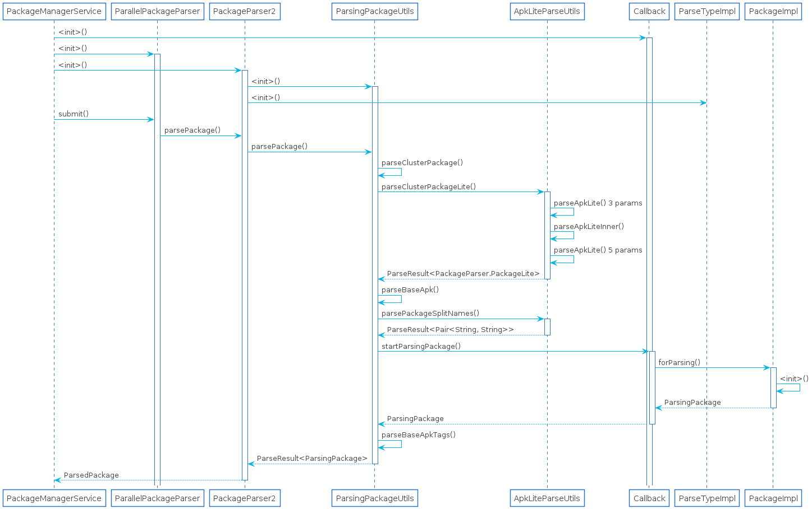

# PkMS解析package指南

> 本篇文章只是作为指南引导去看PkMS，不会贴很多代码分析，要对着源码进行看，更多是基于方法分析实现的逻辑，另外就是代码是基于Android 11，与Android 10之前有很大的差别。

## 本文的内容

1. 解析什么？
2. 解析之后得到了什么?
3. 解析过程分析

## 解析什么？

答案是AndroidManifest.xml，因为它相当于应用的配置文件，里面存储了一个Android应用运行所需要的所有信息，PkMS目的就是将配置AndroidManifest.xml解析出来，供应用以及服务(AMS启动四大组件会从PkMS找信息)使用，PkMS设计的目的无非就是提供对应用的**增删改查**的操作。

## 解析之后的结构

这里列出了部分解析之后的属性信息，可以看到大部分属性其实都可以和AndroidManifest.xml当中的标签对应上，虽然结构是如此，但是在PackageManagerService中使用最主要还是用`AndroidPackage`进行操作属性，这里没有列出`AndroidPackage`的方法，一方面是里面的方法都比较直观，另一方面就是方法实在是太多了，列出来容易忽视掉重点(其实就是懒)。

另外就是解析过程中可能会有很多错误或者异常情况，所以AOSP开发者用了一个`ParseInput`来专门处理错误，下面解析过程中返回值的UML类图

里面`ResultType`泛型就是`ParsingPackage`或者`ParsedPackage`。

### 为什么要设计ParsedPackage和ParsingPackage

因为AndroidManifest.xml里面的配置都是不可变的，所以在解析完成为了防止修改与配置相关的属性设计了`ParsedPackage`，这个接口只有读配置的操作。

## 解析过程

### UML图

### 什么时候开始解析

这里UML画的是开机解析的过程，很容易想到就是当应用安装(不管是adb还是PackageInstaller)的时候会解析。

### 解析类的初始化

对应UML时序图中的`<init>()`方法，这部分主要是对解析必要的对象进行初始化

#### 初始化ParallelPackageParser

PackageManagerService使用的是线程池对所有应用进行解析，准确的说是生产者/消费者模式进行解析应用，这样做的原因是应用的数量可能会有上百个。`ParallelPackageParser`初始化可以看做是线程池的初始化

#### 初始化PackageParser2

Android 11之前用的是`PackageParser`，`PackageParser2`一共做了下面几件事

1. 初始化`PackageCacher`，cache主要是用在开机的过程当中，使用cache缓存解析结果，可以加快开机的速度，是用空间换时间的一种方式
2. 初始化`ParsingPackageUtils`，它是解析的主要工具类之一
3. 初始化ParseInput.Callback，这部分的代码暂时没有理解透
4. 初始化ThreadLocal，为后面每个线程副本做准备

#### 初始化ParsingPackageUtils

主要是说一下第四个参数`callback`，它的类型是`ParsingPackageUtils.Callback`，一个重要的实现类是在`PackageParser2`当中，实现了`startParsingPackage()`方法，用于创建`PackageImpl`对象。`ParsingPackageUtils.Callback`对象的创建是在`PackageManagerService.<init>()`当中

## 开始解析过程

接下来是按照UML时序图中的由上至下，由左至右的方式分析每个方法的逻辑

#### ParallelPackageParser.submit()

逻辑比较简单直接就是调用`PackageParser2.parsePackage()`方法

#### PackageParser2.parsePackage()

1. 看是否支持使用caches，如果支持且获取到了package信息，则直接返回。一般开机的时候解析是支持cache，安装应用的时候是不支持，至于理由，因为关机的时候基本不会安装应用，所以要cache，而安装应用都是安装新应用，所以不必支持cache
2. 获取ParseInput，这个是直接从ThreadLocal中获取，每一个线程都是单独的一份副本，用于做输出错误信息
3. 调用`ParsingPackageUtils.parsePackage()`继续解析AndroidManifest.xml，解析成功后将
4. 将解析结果的`ParsingPackage`转为`ParsedPackage`使用
5. 如果支持cache，则将解析结果缓存到cachedir当中

#### ParsingPackageUtils.parsePackage()

Android 5.0之前都是调用`parseMonolithicPackage()`，之后默认都是默认使用目录的形式，调用`parseClusterPackage()`，接下来都是通过`parseClusterPackage()`进行解析

#### ParsingPackageUtils.parseClusterPackage()

1. 调用`ApkLiteParseUtils.parseClusterPackageLite`进行轻度解析，主要是对于顶层的manifest、uses-sdk、application等标签进行解析，这一步主要的作用其实是判断当前是否处于`onlyCoreApp`模式，一般工厂模式会有，这种模式下不支持第三方应用，只有加了coreApp标签的应用才会被安装，一般都不会用到
2. 创建`AssetManager`，其功能是用于获取apk当中的资源文件。
3. 调用`parseBaseApk()`解析base apk，这里要区分一下base apk和split apk，split apk是用于支持App bundle，这里主要关注base apk的解析。
4. 调用`parseSplitApk()`解析split apk，

#### ApkLiteParseUtils.parseClusterPackageLite()

这是个*静态*方法，会对于目录内所有的.apk文件进行解(base apk和split apk)

1. 递归调用`parseClusterPackageLite()`对子目录进行解析
2. 遍历目录内的每个apk文件调用`parseApkLite()`，并获取结果
3. 获取包名和版本号，并检查split和base apk是否一致，防止安装错误应用，要求base.apk和所有的split apk都需要有相同的包名和版本号
4. 获取base apk，base 和 split apk中重要的区别方式是split apk必须包含split name，而base apk中的split name为null
5. 打包base apk和split apk的属性

#### ApkLiteParseUtils.parseApkLite(ParseInput input, File apkFile, int flags) 

直接调用`parseApkLiteInner`

#### ApkLiteParseUtils.parseApkLiteInner()

1. 获取XmlResourceParser，并打开AndroidManifest.xml准备解析
2. 判断是否需要获取签名，一般是不用，目前没看到什么地方需要获取签名的情况
3. 最后调用`parseApkLite()`，注意这个是重载的5个参数的方法

#### ApkLiteParseUtils.parseApkLite()，5个参数

1. 调用`ApkLiteParseUtils.parsePackageSplitNames()`获取split name,这里不进行进一步分析，因为基本就是xml解析的基本操作而已，这里base apk返回的是null
2. 继续解析其他标签，填充 ApkLite中的属性

#### ParsingPackageUtils.parseBaseApk()

对于base apk的AndroidManifest.xml中的标签全面的解析，并返回ParsingPackage。

1. 调用`ApkLiteParseUtils.parsePackageSplitNames()`获取base apk的split name, 它里面的值应该为null
2. 判断split name是否为null，不为null会报错
3. 调用`Callback.startParsingPackage()`，创建一个空的解析结果
4. 调用`parseBaseApkTags()`，解析AndroidManifest.xml中的标签，并将结果放到`ParsingPackage`中

#### ApkLiteParseUtils.parsePackageSplitNames()

不进一步分析，xml的解析操作

#### Callback.startParsingPackage()

它的实现是在`PackageParser2.Callback`抽象类中，通过`PackageImpl.forParsing()`创建`PackageImpl`对象

#### ParsingPackageUtils.parseBaseApkTags()

不做进一步分析，解析xml的tag，并填充到`ParsingPackage`当中

