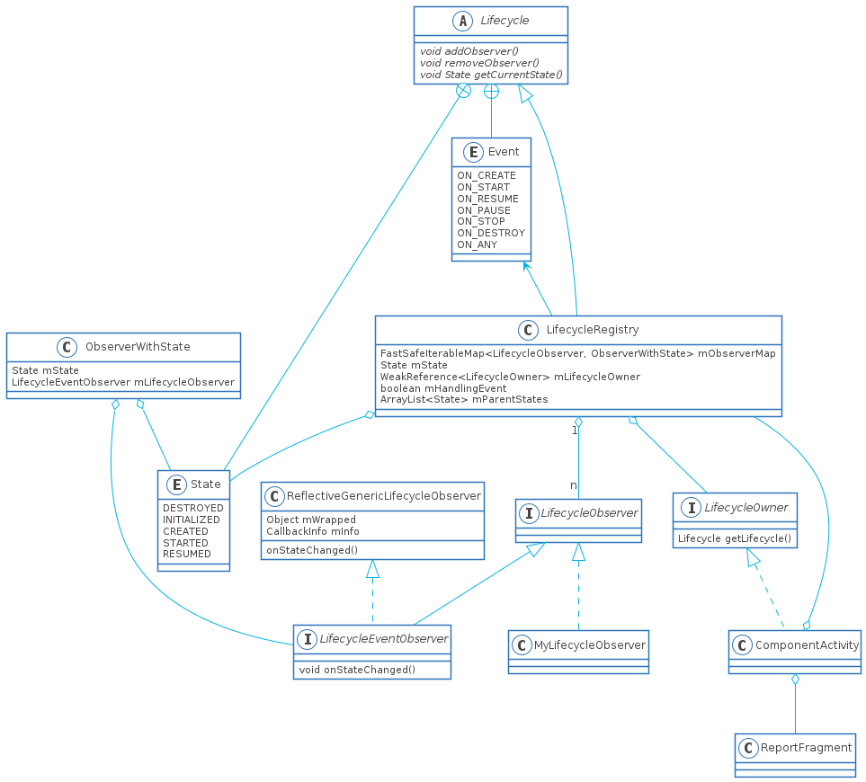

# Lifecycle源码阅读指南

本文内容如下:

1. Lifecycle基本使用
2. 如何添加LifecycleObserver
3. Lifecycle如何实现回调的

## Lifecycle基本使用

Lifecycle作为Jetpack组件和MVVM的基石，其基本原理却非常简单，就是一个观察者模式的特殊应用，使用起来也很简单

1. 导入Jetpack组件`implementation 'androidx.appcompat:appcompat:1.2.0'`

2. 定义一个`public class MyLifecycleObserver implements LifecycleObserver`,LifeCycleObserver只是一个空接口，这个后面到时详细阐述，接下来要为需要在生命周期回调的方法中添加注解，**这个可以理解为在LifecycleObserver中有State的接口，然后可以在对应的接口中调用你的方法，**可能比较难以理解，但是大概是这么个意思

    ```java
    public class MyLifecycleObserver implements LifecycleObserver {
        public static final String TAG = "MyLifecycleObserver";
        //注解可以理解为下面的方法
        //@Override
        //public void ON_CREATE() {
        //    create();
        //}
        @OnLifecycleEvent(Lifecycle.Event.ON_CREATE)
        public void create() {
            Log.d(TAG, "create: ");
        }
        @OnLifecycleEvent(Lifecycle.Event.ON_START)
        public void start() {
            Log.d(TAG, "start: ");
        }
        @OnLifecycleEvent(Lifecycle.Event.ON_RESUME)
        public void resume() {
            Log.d(TAG, "resume: ");
        }
        @OnLifecycleEvent(Lifecycle.Event.ON_DESTROY)
        public void destroy() {
            Log.d(TAG, "destroy: ");
        }
    
    }
    ```

3. 然后在需要的地方注册回调，这里有个有趣的现象是当在onResume中注册方法时，MyLifecycleObserver中的create()和start()都会调用，具体的原因我们后面再说

    ```java
    @Override
    protected void onResume() {
        super.onResume();
        getLifecycle().addObserver(new MyLifecycleObserver());
    }
    ```

## Lifecycle类图



看起来比较复杂是吧，下面稍微介绍一下其中的核心类

1. Lifecycle，这是个抽象类，主要功能就是提供添加，移除LifecycleObserver
2. LifecycleRegistry, Lifecycle的子类，主要功能就是实现Lifecycle中的方法以及触发LifecycleObserver中的回调
3. State,Event，枚举类型，分别对应Activity的状态和生命周期，
4. LifecycleOwner, 就是一个获取Lifecycle的接口，一般是返回LifecycleRegistry
5. ComponentActivity, 用于获取LifecycleRegistry
6. ReportFragment，无界面的Fragment，用于回调生命周期方法
7. ObserverWithState, LifecycleRegistry的子类，通过它回调ReflectiveGenericLifecycleObserver中的回调方法
8. ReflectiveGenericLifecycleObserver， MyLifecycleObserver的装饰器类，通过反射来调用注册了生命周期的方法

**解释一下State和Event的关系，这点相当重要，INITIALIZED状态是个辅助状态，并不在Activity的四大状态之中。Acitivyt的四大状态分别为，CREATED->调用了onCreate()之后，onDestroy()调用之前， STARTED->调用onStart()之后，onStop()调用之前， RESUMED->onResume()调用之后，onPause()调用之前，理解了这点之后我们才可以理解getStateAfter()方法，其实真正的方法名应该是getStateAfterEvent()，意味着某个生命周期方法调用之后的State。后面还会提到**

## Lifecycle添加和移除

移除非常简单，直接将observer从mObserMap中移除即可，添加这部分我们可以从`getLifecycle().addObserver(new MyLifecycleObserver());`开始看，由于ComponentActivity实现了LifecycleOwner，并且返回的是LifecycleRegistry，所以是从LifecycleRegistry.addObserver()开始

### 时序图


解释一下：

actor 指的Activity中的生命周期方法

loop表示循环

alt表示判断条件为真

### LifecycleRegistry.addObserver()

1. 确定开始时的State,注意State的大小，去看UML中的排序就是State的大小,DESTROY最小，RESUME最大，而初始状态是DESTROYED或者INITIALIZED，可以理解为常量0,1,2,3,4
2. 创建ObserverWithState对象并将其push到FastSafeIterableMap,**注意是以LifecycleObser作为key**，这里的FastSafeIterableMap并不是一个标准的HashMap，而是一个带双向链表的Map，为啥不直接用LinkedHashMap呢？不懂
3. 判断之前是否有这个observer，如果已经存在就无需添加了，例如：在onResume中添加observer，然后用户home回到桌面又重新进入的情况
4. 判断是不是正在添加或者是正在处理Event，至于这里是为什么要这样设计，后面进行解释
5. 调用calculateTargetState()计算State，这里是取mParentStates, mState和previous State的最小值作为targetState，原因也是后面解释
6. 从INITIALIZED或者DESTROYED状态到目标状态依次调用ObserverWithState.dispatchEvent()，这里就进入了分发事件了
7. 如果是第一次添加，并且没有状态的变化，就调用sync()进行同步所有的状态

### ObserverWithState.dispatchEvent()

这部分逻辑比较简单

1. 在构造器中调用`Lifecycling.lifecycleEventObserver(observer)`获取当前的LifecycleEventObserver的包装类，以注解为例，应该是返回ReflectiveGenericLifecycleObserver，另外两个分别是LifecycleEventObserver和FullLifecycleObserver，前一个是用户自定义实现LifecycleEventObserver，后一个则是对于每个Event都会回调方法，与Activity的生命周期同步
2. 之后调用LifecycleEventObserver.onStateChanged()进行回调，之后通过反射获取注册进去的LifecycleObserver的注解，并调用对应的方法

### LifecycleRegistry.sync()

1. 调用isSynced()判断所有的观察者是否都已更新到最新的State中，里面值做了双向链表的头和尾的判断，这里就引出了一个非常重要的概念，那就是**所有的observer是根据加入时间来做有序的，先加的observer先调用**
2. 首先看`mState.compareTo(mObserverMap.eldest().getValue().mState) < 0`这判断条件，也就是说双向链表中的头节点大于当前State,很显然这种情况发生在onResume->onPause->onStop这种生命周期调用中，所以对每个头节点回退到当前的mState，并调用observer中对应方法
3. 接着`!mNewEventOccurred && newest != null && mState.compareTo(newest.getValue().mState) > 0`mNewEventOccurred不是很理解，除非是多线程，否则不该出现这种判定，newest比较好理解，当分发事件的过程中，有可能所有的observer都remove掉自己就可能出现这种情况，最后`mState.compareTo(newest.getValue().mState)>0`，很显然是在onCreate->onStart->onResume这种生命周期中
4. backwardPass和forwardPass的方法差不多，forwardPass是从前往后遍历，保证升序调用ON_CREATE->ON_START->ON_RESUME，backwardPass则相反,从后向前遍历，保证ON_PAUSE->ON_STOP这种遍历是有后往前遍历

### 什么是observer有序性

即先加入observer的从onCreate->onStart->onResume的回调方法要**先于**后加入的observer调用，而从onPause->onStop则要**后于**后加入的observer调用，为此，Lifecycle可谓是费尽了心思

### isReentrance的作用

考虑这样一种场景，在observer的某个onStart()方法中添加一个新的observer，这种我自称是订阅嵌套，对于这种情况，为了保证只同步一次的效果，所以设置了只在添加第一个observer且mHandlingEvent为false的时候才同步，因为mHandlingEvent为true的时候自己会同步

### calculateTargetState()计算方式

为什么要设置这种方式，还是上面的订阅嵌套为例，为了保证有序调用，如果设置为mState，那么调用就会出现后加的observer的onResume()方法先于前面加的observer，那mParentStates又是什么作用呢？

### mParentStates的作用

官方举的例子如下：

```java
void onStart() {
    mRegistry.removeObserver(this);
    mRegistry.add(newObserver);
    //may have others logic
}
```

怎理解这个例子：

1. onStart()是在一个lifecycleObserver里面的方法，而非Activity中的，
2. 我们这里做个假设：里面只有一个当前Observer，此时先移除自己，然后再添加一个新的observer，此时假设mState为RESUMED，如果没有mParentStates，由于mState是RESUMED，previous被移除了也为null，那么新observer就会一路从ON_CREATE->ON_START->ON_RESUME这么调用，但移除的那个observer的onStart()可能还有逻辑没有跑完，这样可能不符合应用的需求，应该是onStart跑完之后然后才是新observer开始调用。mParentStates此时就有作用了，由于mParentStates存储了当前observer的STARTED的状态，那么observer就会targetState就会被设置成CREATED，而不是直接设置成RESUMED

## Lifecycle如何实现回调

Lifecycle的回调有两种方式：

1. addObserver()的时候会进行dispatchEvent()
2. 生命周期发生变化或者出现调用setCurrentState()的情况

### 时序图


从时序图上看是比较简单，不过这只是happy path，要理解就要深入解析他们是如何通过反射获取注解，然后通过反射调用方法，那边逻辑虽然比较多但是并不复杂

### getStateAfter()

这里的意思应该是getStateAfterEvent()，之前有说过关于State和Event之间的关系这里再理清一下

1. Event的每个变量都对应着Activity的生命周期方法，所以接下来我会以生命周期方法来指代
2. 可以将State的变化可以理解为State的链表。在onCreate()调用之后State变为CREATED这个很好理解，但是CREATED是个状态，所以在onDestroyed()调用之前**onStop()调用之后**，这段时间中Activity处于CREATED状态
3. 其他的状态同理，onStart()调用之后以及onPause()调用之后，State变成STARTED，而RESUMED和DESTROYED这两个状态可以认为是状态链表的尾和头，一开始Activity并不是从CREATED状态，而应该是DESTROYED状态

## 使用Lifecycle需注意的点

1. 最好不要在子线程添加observer，虽然没有添加@MainThread标签，但里面的数据并没有进行保护
2. 注解的回调方法中不要加其他参数，除了固定格式的如`method(LifecycleOwner owner)`或者`method(LifecycleOwner owner, Lifecycle.Event event)`