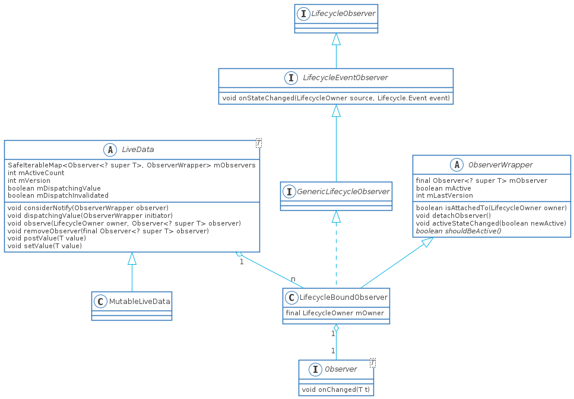

# LiveData源码阅读指南

本文内容：

1. LiveData添加observer以及如何和LifecycleOwner的关联
2. LiveData如何实现数据更新
3. LiveData的其他问题
    1. 为什么在mPostValueRunnable中，明明是主线程，还要加synchronized
    2. 为什么dispatchingValue()要写的这么复杂
    3. 为什么在considerNotify()中要二次检查shouldBeActive()

## 类图



LiveData的类图比较简单，应该无需多做解释

## LiveData添加Observer

1. 判断是否是主线程，这点和Lifecycle就不一样，直接指定了只能在主线程中添加Observer
2. 判断是否已DESTROYED，在onDestroyed()调用之后添加就没有用了
3. 创建Observer的wrapper对象,类型为LifecycleBoundObserver，详细看UML类图，它不仅是ObserverWrapper，而且实现了LifecycleEventObserver
4. 将wrapper对象push到mObservers中
5. 将LifecycleBoundObserver对象加入到Lifecycle中，这一步会回调对应的生命周期方法

## LiveData实现数据更新

LiveData的数据更新分为两种

1. 生命周期触发数据更新，这是为了保持数据和之前的一致
2. 通过setValue()/postValue()主动更新数据

### 生命周期触发数据更新

由于将LifecycleBoundObserver加入到Lifecycle中，所以Activity的生命周期变化自然会触发LifecycleBoundObserver的`onStateChanged()`方法

#### LifecycleBoundObserver.onStateChanged()

1. 判断是否是DESTROYED，是则要移除对应的observer，否则可能会引起内存泄露，想象一下：屏幕旋转的情况，ViewModel未被销毁, ViewModel持有LiveData, LiveData持有Observer，Observer持有Activity
2. 调用`activeStateChanged(boolean newActive)`，这里会传入`shouldBeActive()`方法返回值，在LifecycleBoundObserver中，它指代的是当生命周期在onStart()调用之后onStop()调用之前的STARTED状态才会为true

#### ObserverWrapper.activeStateChanged()

1. 如果已经新老状态相同，则直接返回
2. 更新状态，获取当前是不是第一个更改的Observer
3. 增加mActiveCount加一或减一，
4. 如果是第一状态改变并且是mActive，则回调`onActive()`，另一个`onInactive()`逻辑相似，**从这可以看出mActiveCount的作用就是判断当前的observer是不是第一个active或者第一个deactive**
5. 如果是新状态是STARTED之后，则调用`dispatchingValue(this)`，注意此时的参数

### postValue()主动更新数据

`postValue()`是异步更新，而`setValue()`则是同步更新，`setValue()`必须是在主线程调用，而`postValue()`没有这个限制，根据文档`postValue()`会比`setValue()`晚更新(并且这个是跨生命周期的)，具体的看Handler处理消息的机制。由于`postValue()`最终也是调用到`setValue()`，所以我们分析`postValue()`即可

#### LiveData.postValue()

1. 定义了postTask，注意postValue()可能会在多个线程中调用，postTask是线程私有的
2. 给postTask赋值，这里我不是特别理解为啥mDataLock和mPendingData要用volatile标记，synchronized不是会取消缓存行吗？
3. 更新mPendingData为post过来的value
4. 如果postTask为false，则直接return，**对于所有post的线程，我们只需最新的数据发送一次就可以了，不需要多余的更新**
5. 给主线程发送消息，在mPostValueRunnable当中

#### mPostValueRunnable.run()

1. 先给newValue复制，这里添加synchronized原因见问题1的答案
2. 将mPendingData重置
3. 调用setValue()继续更新数据

#### LiveData.setValue()

1. 判断是否是在主线程，否则直接抛出异常
2. 将数据的版本号+1，更新当前的value
3. 调用`disPatchingValue(null)`，注意和`ObserverWrapper.activeStateChanged()`中的调用的参数区别，这个很重要

### LiveData.dispatchingValue()

1. 如果正在分发，则先返回，并且将mDispatchInvalidated设置为true，这部分逻辑后面进行解释
2. 由于`ObserverWrapper.activeStateChanged()`传入了ObserverWrapper对象，所以会直接调用considerNotify()方法，这里注意initiator要重置为了null，原因后面再说
3. 如果是`setValue()`调用，则对每一个Observer都更新其数据，调用`considerNotify()`

#### LiveData.considerNotify()

1. 判断`observer.mActive`是否为true，也就是初步判断状态是否为STARTED，这步是为了setValue()而设计的，因为setValue()可能在任何地方调用
2. 再次判断状态是否为STARTED，原因后面具体讨论
3. 判断mLastVersion是否小于LiveData的数据版本，是的话，则调用Observer.onChanged()，但我觉得这里可以改成==，因为mLastVersion不会大于mVersion

## LiveData数据最新保证

也就是LiveData要尽量保证mData是最新值，也要保证`Observer.onChange()`最后一次的回调是最新的数据，为了这个条件也是费劲了心思，下面的问题答案都是为了这个前提

### 为什么在mPostValueRunnable中，明明是主线程，还要加synchronized

这里的原因是要等到postValue()中所有的线程都完成了pendingData更新，因为LiveData只需要最新的数据，其他中间数据都不关心

### 为什么dispatchingValue()要写的这么复杂

先说一下mDispatchingValue和mDispatchInvalidated，从字面意义上就比较容易理解这两个分别说的是正在更新值，以及需要刷新值。那么这两个变量有什么作用呢？

这两个变量最主要的作用就是在调用`observer.onChange()`中又setValue()了，于是就出现数据更新了，那么如果此时没有这两个变量以及循环，我们来考虑一下状况：

​		setValue()调用，在某个`observer.onChange()`中又调用了setValue()，假设为observer_1，那么就会出现observer_1之后的那些observer会出现连续调用两次considerNotify()并且两次都是第二次setValue()的值，这里需要想象一下链表的循环，这样虽然数据不会重复调用，因为有mVersion的存在，但是效率会降低

上面只是举了一个第二次调用，如果出现第三次，第四次。所以dispatchingValue()设计了这套机制

```java
void dispatchingValue(@Nullable ObserverWrapper initiator) {
    if (mDispatchingValue) {
        mDispatchInvalidated = true;
        return;
    }
    mDispatchingValue = true;
    do {
        mDispatchInvalidated = false;
        if (initiator != null) {
            considerNotify(initiator);
            initiator = null;
        } else {
            for (Iterator<Map.Entry<Observer<? super T>, ObserverWrapper>> iterator =
                 mObservers.iteratorWithAdditions(); iterator.hasNext(); ) {
                considerNotify(iterator.next().getValue());
                if (mDispatchInvalidated) {
                    break;
                }
            }
        }
    } while (mDispatchInvalidated);
    mDispatchingValue = false;
}
```

当出现嵌套setValue()的时候，假设还是observer_1好了，此时的逻辑如下

1. mDispatchingValue由于为true，所以mDispatchInvalidated也设置了为true，直接return
2. 此时回到了遍历的循环中的considerNotify()下一行，判断mDispatchInvalidated为true，跳出遍历循环
3. while()的判断mDispatchInvalidated也是true，这是重新进行遍历更新数据，这样observer_1之后的链表就只会更新一次，observer_1之前的当然会出现两次更新，但是他们的数据不同，可以理解

当生命周期间出现嵌套setValue()的时候，`initiator = null`就好理解了，假如出现了更新，所以先将其转为setValue()的那种更新，这种先更新了一遍，那生命周期还是会驱动后面的observer更新啊，怎么办呢？mVersion就起到作用了

### mVersion的作用

mVersion一个是上面所说的，另外一个则是在刚刚添加observer的时候，想象一下：假如在onResume里面添加一个observer，生命周期驱动数据更新的时候如果没有mVersion的话，那么就会回调一个空指针

### 为什么在considerNotify()中要二次检查shouldBeActive()

这里也是嵌套的原因，比如在LifecycleObserver中的onStop()中调用LiveData.setValue()方法，此时LiveData的LifecycleObserver还没有回调到，应该就会出现这种情况


