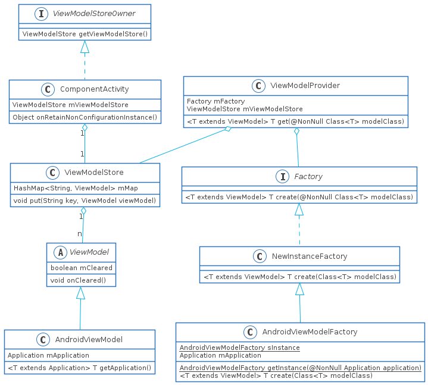

# ViewModel源码阅读指南

本文内容：

1. ViewModel的创建流程
2. 为什么ViewModel可以做到存储数据的效果
3. ViewModel与onSavedInstanceState()的关系

## UML类图

架构还是比较清晰的，毕竟是三剑客里面最简单的一种，里面最核心的是ViewModelProvider和ViewModelStore。ViewModelProvider用来提供获取ViewModel的接口，ViewModelStore则是用于存储ViewModel实例。而Factory接口则用于创建ViewModel，创建ViewModel的方式可以多种多样，原生提供了三种，分别是不带参数的NewInstanceFactory，拥有自己的key值的KeyedFactory，以及拥有Application对象的AndroidViewModelFactory。

## ViewModel的创建流程

不要将ViewModel想的多么神秘，它就是空类，唯一的作用，就是将你的对象能够挂上ViewModelStore的Map中。`new ViewModelProvider(this, new ViewModelProvider.NewInstanceFactory()).get(TimerViewModel.class)`一般我们直接使用这种方式获取一个ViewModel对象，想一下为什么不选择直接传入一个ViewModel对象？

### ViewModelProvider.get()

这里有两个重载的方法，一个不带key另一个则是带key。带key的那个公开的原因是为了KeyedFactory服务，而不带key则会用canonicalName生成一个默认key。为什么要这么设计呢？因为带key可以为同一个ViewModel创建不同的实例，否则一个ViewModel只能创建一个实例。下面我们以带key的重载方法为例

1. 先从ViewModelStore中获取，获取到了则返回ViewModel对象
2. 判断当前是哪种Factory，并调用对应的create方法创建对象

## 为什么ViewModel可以做到存储数据的效果

这里的核心就在于Acitivity的`onRetainNonConfigurationInstance()`可以意外销毁的Activity中数据保存到内存中，那么是谁持有呢？当然是ActivityThread，因为它的生命周期与进程是相同，另外Activity也是它创建，所以恢复引用也比较方便。那么又是怎么恢复的呢？在Activity.attach()的时候传入参数进行恢复

## ViewModel与onSavedInstanceState()的关系

其实官网已经解释的非常清楚了

|                                                | ViewModel                              | onSavedInstanceState                       | 持久性存储空间                              |
| :--------------------------------------------- | :------------------------------------- | :----------------------------------------- | ------------------------------------------- |
| 存储位置                                       | 在内存中                               | 已序列化到磁盘                             | 在磁盘或网络上                              |
| 在配置更改后继续存在                           | 是                                     | 是                                         | 是                                          |
| 在系统发起的进程终止后继续存在                 | 否                                     | 是                                         | 是                                          |
| 在用户完成 Activity 关闭/onFinish() 后继续存在 | 否                                     | 否                                         | 是                                          |
| 数据限制                                       | 支持复杂对象，但是空间受可用内存的限制 | 仅适用于基元类型和简单的小对象，例如字符串 | 仅受限于磁盘空间或从网络资源检索的成本/时间 |
| 读取/写入时间                                  | 快（仅限内存访问）                     | 慢（需要序列化/反序列化和磁盘访问）        | 慢（需要磁盘访问或网络事务）                |

所谓用户发起的关闭有以下几项：

1. 按返回按钮
2. 从“概览”（“最近使用的应用”）屏幕中滑动关闭 Activity
3. 从 Activity 向上导航
4. 从“设置”屏幕中终止应用
5. 完成某种“完成”操作（由 Activity.finish() 提供支持），即应用程序调用了Activity.finish()的操作

更加详细的内容请参考官网中的[保存界面状态](https://developer.android.com/topic/libraries/architecture/saving-states)

## 使用ViewModel的注意事项

1. 千万不要让你的ViewModel持有任何非Application的Context，否则会引发内存泄露，例如: 成员对象View，Drawable等
2. ViewModel中默认不可以添加带有参数的构造方法，如果需要添加，可以自己实现Factory，然后创建ViewModel的时候用自己的Factory

