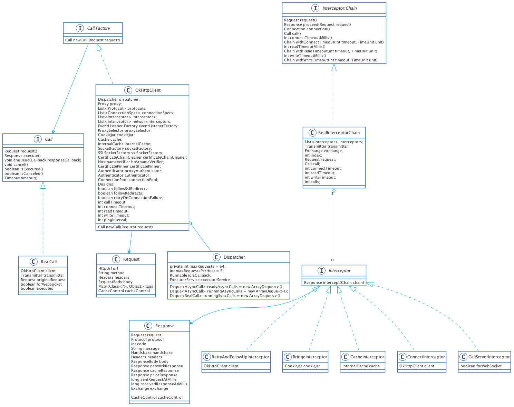
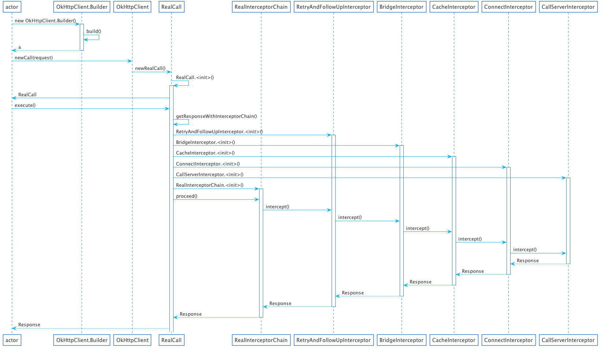

# OkHttp源码阅读指南

本文内容：

1. OkHttp流程指南
2. 各个拦截器的作用
3. Https Dns的实现方式
4. Http1.1和Http/2的实现
5. 连接池的作用与实现

## OkHttp流程

### 类图



这里的类图只画了责任链模式流程中的类图，更重要的网络UML图则会在下面的ConnectInterceptor中

### 流程图



这个流程图只涉及到简单的过程，并未涉及到具体的细节，凸显出来的就是责任链模式，这种模式适合与分层比较明显，但是上下有依赖关系，这种模式可以在很多地方找到相似的例子，例如：对象的初始化(这里建议看C++的)，Input事件的传输和处理，五层网络协议，基本上都是由外而内传递并且由内而外处理的方式

### OkHttp的初始化

先来看一下OkHttp的使用

```java
URL url = new URL("http://www.baidu.com/");
OkHttpClient client = new OkHttpClient.Builder()
            .build();
Request request = new Request.Builder()
                .url(url.toString())
                .build();
okhttp3.Call call = client.newCall(request);
okhttp3.Response response = call.execute();
```

1. 首先，在OkHttpClient.Builder的构造方法中，初始化了许多默认值，如果找不到默认值，则大部分可以从这里获取
2. 在OkHttpClient中，另外创建了SSLSocketFactory用于支持TLS或者是SSL

### RealCall初始化

使用`OkHttpClient.newCall()`创建的是RealCall并且会创建另一个重要的类Transmitter，根据官方注释，这个类可以将okhttp和网络层(其实就是http层)连接起来

### RealCall.execute()

1. 调用Dispatcher.executed()将call加入到执行的Call队列中，这一步的主要目的就是控制Call的启动、终结和取消，但是因为是同步请求，此时已经是启动了
2. 调用`getResponseWithInterceptorChain()`开始向服务器发送请求并获取回应

### RealCall.getResponseWithInterceptorChain()

1. 添加自定义的interceptor，所谓的拦截器，其实就是在发送之前和接收之后可以统一做一些额外的事情，最多就是就是Logging，但是我觉得使用EventListener也是不错的选择，其实也可以放到每个请求里面去做，但这样代码就会重复很多了
2. 依次添加RetryAndFollowUpInterceptor，BridgeInterceptor，CacheInterceptor，ConnectInterceptor，自定义的networkInterceptor(暂时这个没想到对应的应用场景)，
3. 创建RealInterceptorChain对象，之后调用`RealInterceptorChain.proceed()`方法，依次调用每个拦截器处理逻辑

### RealInterceptorChain.proceed()

1. 检查自定义的interceptor是否合法
2. 创建新的RealInterceptorChain，注意index+1
3. 获取index对应的interceptor，并调用`interceptor.intercept()`方法交给Interceptor处理，获取返回值，思考一下为什么不能用循环
4. 要求所有自定义的interceptor要调用`RealInterceptorChain.proceed()`,否则会造成请求无法发出
5. 判断response或者response.body()是否为空

## 拦截器的作用

首先回顾一下五层网络模型，http是处于应用层，这也就意味着http协议都是应用实现的，最终通过socket传到TCP传输层，先来看看假如不用okhttp框架怎么发送http请求

```java
String path = "http://www.baidu.com/";
String host = "www.baidu.com";
Socket socket = null;
OutputStreamWriter streamWriter = null;
BufferedWriter bufferedWriter = null;
try {
  socket = new Socket(host,80);
  streamWriter = new OutputStreamWriter(socket.getOutputStream());
  bufferedWriter = new BufferedWriter(streamWriter);
  bufferedWriter.write("GET " + path + " HTTP/1.1\r\n");
  bufferedWriter.write("Host: www.baidu.com\r\n");
  bufferedWriter.write("\r\n");
  bufferedWriter.flush();
  BufferedReader in = new BufferedReader(new InputStreamReader(socket.getInputStream(),"UTF-8"));
  int d = -1 ;
  while((d = in.read()) != -1){
    System.out.print((char)d);
  }
} catch (IOException e) {
  e.printStackTrace();
}
```

1. 首先是建立socket连接，这一步相当于建立三次握手连接
2. 发送http请求
3. 获取http协议返回结果

而okhttp则是将http协议实现在interceptor当中，每个部分对于http相应的部分进行实现，从而达到充分解耦的目的

### RetryAndFollowUpInterceptor

从这个名字就可以很容易的看出，这是一个重试和继续的拦截器，为什么要重新发送请求

1. 路由失败，这里稍微解释一下路由就是一个web服务可能会有代理或者多个IP地址，这些就可以组成所谓的路由，只要我们能够连通其中任意一条路由即可与服务器通信，所以在路由失败之后还可以选择其他的路由进行连接
2. 获取到3xx的重定向要求进行重定向请求，服务器或者代理要求认证信息

接下来看一下`intercept()`的流程：

1. 设置一个死循环，对上面两个可能的情况进行不断的重新发送请求
2. 调用`Transmitter.prepareToConnect()`创建预备的对象，如：ExchangeFinder，Address，RouteSelector
3. 接下来调用`RealInterceptorChain.proceed()`，由下一个Interceptor继续处理并获取其返回的response
4. 处理路由异常和IO异常，这里列举的不可以重试的异常，详细的见`recover()`方法
5. 调用`followUpRequest()`进行跟进处理，这里面根据服务器返回码进行相应的处理，具体的要翻看http协议返回码对应的意义
6. 根据followUp的结果判断是否需要重新发送请求或者直接返回response

### BridgeInterceptor

这个拦截器比较简单，就是将用户设置的Request进行重新封装，变成真正的Http请求，说的直白一点就是补充Http请求中的头，如果用户有设置的就无需再进行设置了，之后还要对response进行一些处理，比如：保存cookie，解压缩ResponseBody

1. 补充Http请求中的头
2. 调用`RealInterceptorChain.proceed()`，由下一个Interceptor继续处理并获取返回的response
3. 解析返回的Response，保存cookie，解压缩ResponseBody

### CacheInterceptor

这个Interceptor主要是实现If-Modified-Since这种类型的请求，详细请参考http协议，这个字段的功能是

> 判断客户端缓存的数据是否已经过期，如果过期则获取新的数据

这个字段通常用于服务器需要返回大文件的情况，可以加快http传输速度，接下来看一下`intercept()`的流程

1. 获取当前缓存策略，里面还有一些东西还没搞明白，应该都是对于Cache-Control字段的解读吧
2. 获取缓存的Request和Response，这里面的Request一般由userRequest修改而来
3. 判断networkRequest是否为null，是的话直接返回缓存的Response，什么时候Request会变成null，在Cache-Control字段为only-if-cached，或者是userRequest为null的时候，这么想来能否在没有网络的时候通过这种方式缓存服务器的信息呢？
4. 调用`RealInterceptorChain.proceed()`，由下一个Interceptor继续处理并获取返回的response
5. 如果返回的code为HTTP_NOT_MODIFIED，则返回缓存的Response并更新缓存的Response，主要过期的时间由更新，对应If-Modified-Since字段的date
6. 否则缓存失效，使用服务器返回的Response，并更新缓存，更新缓存前要判断对应的缓存策略是否支持缓存

### ConnectInterceptor

这算是okhttp的核心代码了，里面有些概念也没搞得太清楚，其逻辑也比较复杂。但是有三个核心是不变的：

1. DNS请求，将hostname转为ip地址
2. 建立socket，进行三次握手
3. 进行TLS握手

不过这里面还有两个理论问题，

1. 是如何确认使用http1.1还是http2
2. 如何确认使用http还是https

下面先解释一下：

1. Okhttp目前支持http1.1和http2，这是两个协议，http2要求服务器支持TLS1.2，如果url的scheme部分不是https字符串的话，则不支持http2，默认使用http1.1，如果要使用其他协议要进行指定，详细的请看Protocol.java。另外如果支持TLS1.2，则通过TLS1.2判断是否服务器和客户端支持HTTP2
2. 就是靠scheme中的字符串是http还是https，如果是https则会尝试和服务器进行TLS握手

接下来看一下`intercept()`的流程

1. 创建新的Exchange对象，这个Exchange对象相当于I/O和socket连接交互的桥梁
2. 调用`RealInterceptorChain.proceed()`，由下一个Interceptor继续处理并直接返回对应的Response

从上面看来，最终的步骤就是创建Exchange对象

#### UML图


稍微解释一下其中类的含义和作用

1. Transmitter: 桥接okhttp应用层和网络层，在我个人看来更多像是控制socket启动和取消的接口
2. Exchange: 跟I/O层交互的对象的存储类
3. ExchangeFinder: 用于查找和创建RealConnection的对象
4. ExchangeCodec：用于发送I/O请求的接口
5. RouteSelctor：用来创建Rout和Proxy，并且负责进行DNS解析的类
6. Selection: RouteSelector的子类，用于存储Route的包装类
7. Http1ExchangeCodec: Http1.1用于和I/O交互的类，codec是Code和Decode的缩写
8. Http2ExchangeCodec: Http2用于和I/O交互的类
9. Connection: socket和TLS连接的接口
10. Address：里面存储了连接所需要的一些属性
11. Route:路由，即代理和Address的包装类
12. RealConnection: 用来做socket连接以及TLS握手

#### 时序图


#### Transmitter.newExchange()

这个方法逻辑很简单，只是调用`ExchangeFinder.find()`创建ExchangeCodec对象，之后将其作为参数创建Exchange对象

#### ExchangeFinder.find()

做了两件事情：

1. 调用`findHealthyConnection()`获取RealConnection
2. 调用`RealConnection.newCodec()`创建ExchangeCodec对象Http2ExchangeCodec或者Http1ExchangeCodec

#### ExchangeFinder.findHealthyConnection()

1. 建立一个无限循环，这里的无限循环是为了health而建立的，为什么不会出现死循环呢？
2. 调用`findConnection()`，查找或者新建一个RealConnection
3. 如果是个新的RealConnection，则直接返回
4. 判断是否是个HealthyConnection，Healthy定义就是socket是否已经关闭了，另外如果不是一个健康的Connection则会释放掉

说明一下为什么不会出现死循环，这是因为如果不是一个HealthConnection，会找到下一个Connection，如果所有的Connection都不是Healthy的话，则会新建一个Connection，这个Connection就必定会是Healthy的

#### ExchangeFinder.findConnection()

1. 尝试直接获取Transmitter.connection，失败的情况包括Transmitter.connection为null或者Transmitter.connection无法创建Exchange
2. 尝试从RealConnectionPool获取匹配的情况Connection，匹配的条件主要是`isEligible()`：
    1. 已经费配过Transmitter或者这个Connection无法创建Exchange，则不匹配
    2. 是否是同一个Address，是则匹配上了
3. 根据条件选择对应的Route，为创建新Connection做准备，这几个条件还没理解透
4. 第二次尝试从RealConnectionPool获取匹配的情况Connection，这次匹配的条件在于DNS之后获取的Routes
5. 如果还是未获取到则创建新的RealConnection
6. 调用`RealConnection.connect()`方法，进行socket和TLS连接
7. 第三次尝试从RealConnectionPool获取匹配的Connection，匹配的条件则是requireMultiplexed = true
8. 如果还是没有获取到，则更新connectionPool

第一次获取的是http1.1或者http2的Connection，第二次为了获取http2的Connection，第三次则不知道是怎么回事了

#### RealConnection.connect()

1. 检查Connection的合法性
    1. 如果不支持https，则ConnectionSpec的类型必须包含CLEARTEXT(纯文本请求，例如：HTTP, FTP等)，默认包含
    2. 根据平台判断是否支持CLEARTEXT类型请求，
2. 判断是否存在HTTP代理，如果是则调用`connectTunnel()`连接，**隧道原理还未了解明白，先不做了解**
3. 否则调用`connectSocket()`创建rawSocket并进行三次握手
4. 调用`establishProtocol()`识别协议

#### RealConnection.connectSocket()

1. 如果是代理是HTTP类型或者没有代理，则从SocketFactory创建Socket，调用平台的`connectSocket()`，AndroidPlatform没有特殊处理，直接调用`socket.connect()`进行连接
2. 创建Source和Sink，分别对应InputStream(获取HTTP响应)和OutputStream(用于发送请求)

#### RealConnection.establishProtocol()


