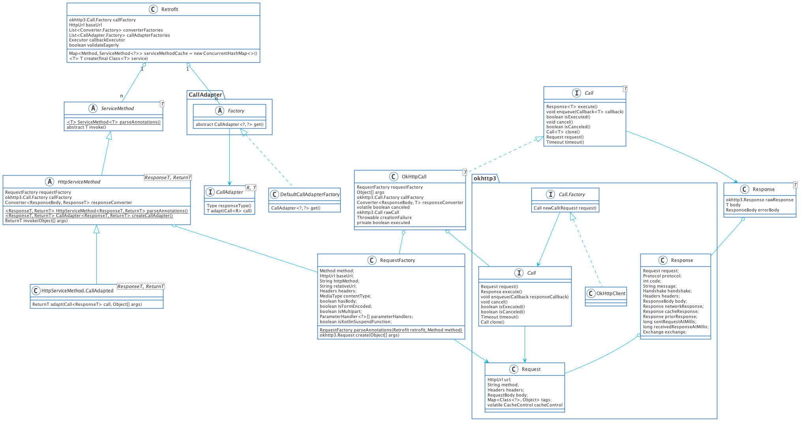

# Retrofit源码阅读指南

本文内容：

1. Retrofit调用过程
2. Retrofit的设计模式

## UML 类图



Retrofit的UML图是相当难画，里面类和接口嵌套相当的深，这只是一个简略图，方便在阅读源码的时候理清接口和实现类之间的关系。

这里解释一下, Retrofit和okhttp框架是强依赖的，所以用okhttp3框起来的是是okhttp内的代码，其他的则是Retrofit的，CallAdapter是个例外，我是为了表达子类，结果plantuml识别成了包

## Retrofit调用过程

在阅读源码之前先来看一下Retrofit是怎么使用的

```java
public interface GitHubService {
  @GET("users/{user}/repos")
  Call<List<Repo>> listRepos(@Path("user") String user);
}
Retrofit retrofit = new Retrofit.Builder()
    .baseUrl("https://api.github.com/")
    .build();

GitHubService service = retrofit.create(GitHubService.class);
Call<List<Repo>> repos = service.listRepos("octocat");
repos.execute();
```

上面的摘自官网，运行不了可别怪我。从示例代码中可以看到，Retrofit的使用分为四个步骤：

1. 创建Retrofit实例
2. 创建GitHubService的代理对象
3. 通过代理对象调用方法，获取`Call<T>`对象
4. 调用`Call.execute()`

接下来我们对这四个步骤依次分析，至于`CallAdapter`和`Converter`的详细情况暂不在本文讨论范围内

### Retrofit.Builder.build()

Retrofit实例的创建是通过Build模式进行的，相类似的例如Dialog的创建也是通过Build模式，适合于属性比较多的类型且有默认属性的情况。`build()`大致情况如下

1. 确认baseUrl存在，一个Retrofit对象对应服务器上的一个服务
2. 设置`okhttp3.Call.Factory`，默认使用`OkHttpClient()`，这个要记住
3. 设置从okhttp回调的`Executor`，默认是用的主线程
4. 设置CallAdapter和Convert，这CallAdapter曾困扰了我很久，一直找不到它的默认实现，就是build()方法没有看仔细，说一下CallAdapter和Convert的作用，CallAdapter用于转换`Call<T>`，Convert则用于转换ResponseBody，这两个都是用了适配器模式
5. 用上述参数创建Retrofit实例并返回

### retrofit.create()

这里用的动态代理模式，不过这里可能和你在网上找到的不一样，因为这里不需要实现接口中的方法

1. 调用`validateServiceInterface`check定义的`GithubService`是否合法，
   1. 判断当前`GithubService`是否为接口
   2. 判断GithubService是否带有泛型或者父接口是否带有泛型
   3. 判断是否有预先加载`validateEagerly`，如果有的话就将方法先缓存到serviceMethodCache中
2. 通过`Proxy.newProxyInstance()`方法创建一个GithubService的代理对象，这里解释一下newProxyInstance()的三个参数
   1. ClassLoader，这个是用来加载动态proxy类的。万一你想对代理对象做一些骚操作也可以放入一个自定义的ClassLoader
   2. Class<?>[] interfaces，这个就是需要代理的接口，由此可见，其实动态代理可以代理多个接口
   3. InvocationHandler，它可以和你在网上找到的一样作为中介一样反射调用实现类中的方法，也可以直接作为实现类，调用任何方法。

再稍微解释一下动态代理的原理，即通过动态创建一个$Proxy0的类并根据interfaces生成对应的方法，然后通过ClassLoader加载到虚拟机中并创建其对象，然后向上转型GithubService接口，接着在实现的方法中直接调用`InvocationHandler.invoke()`方法。当分析这些原理的时候不用害怕，至少他们都还是要符合基本规律，计算机的世界可没有什么理所当然

### service.listRepos()

上面说过，在调用这个方法的时候，会通过$Proxy0对象直接调用`InvocationHandler.invoke()`，接下来看一下invoke的逻辑

1. 如果调用的是Object类中的方法，可以直接调用即可
2. 如果是default方法，那也直接调用接口中的default方法
3. 否则就调用`loadServiceMethod`加载对应的Method，这里不会有listRepos()的实现方法
4. 并调用`ServiceMethod.invoke()`方法发送请求

解释一下为什么不需要listRepos()的实现方法，可以回想一下okhttp的使用，它需要的是一个Request，Request则需要很多的参数例如：header，url，http方法类型等等，所以这里的listRepos()只是一个存储了Request所需参数的Method对象而已。所以接下来就是直接将Method对象中的参数获取到并且传递给okhttp即可。

### Retrofit.loadServiceMethod()

这里用了一个double-check的方式进行检测ServiceMethod是否已经在缓存中，采用double-check主要是为了效率。

### ServiceMethod.parseAnnotations()

逻辑如下：

1. 创建RequestFactory，这步的动作就是将Method中Annotations解析出来，然后将对应的属性保存起来，注意：这里还没有到设置参数这一步，只是相当于指定接下来要设置哪些Request的参数，这里面流程虽然不是特别复杂但是很长且需要对于Http的所有的协议和字段都了解才行
2. 检查返回值是否为泛型
3. 调用`HttpServiceMethod.parseAnnotations()`并返回ServiceMethod对象

### HttpServiceMethod.parseAnnotations()

接下来的逻辑会先去除`isKotlinSuspendFunction`判断，默认为false

1. 先获取Method的返回类型，这里注意会同时加上类型的泛型
2. 创建CallAdapter，默认是Retrofit.Builder.build()中创建的DefaultCallAdapterFactory
3. 创建Convert，这里注意第一个泛型参数它是okhttp3.ResponseBody，如果没有加ConvertFactory，那么只能使用这种类型
4. 返回创建的CallAdapted

### HttpServiceMethod.invoke()

在返回ServiceMethod类型之后，直接调用`ServiceMethod.invoke()`，这个方法由HttpServiceMethod进行实现，

1. 创建OkHttpCall对象
2. 使用调用对应的CallAdapter进行对象转换，默认不进行转换

### repos.execute()

回到UML中看一下Call的实现类，就是OkHttpCall，所以直接看`OkHttpCall.execute()`的逻辑

1. 首先调用`getRawCall()`获取okhttp3.Call，如果没有则进行创建
2. 之后调用`okhttp3.Call.execute()`调用到okhttp中执行对应的逻辑

这里就是Retrofit最终的逻辑了，接下来看一下怎么获取okhttp3.Call

### OkHttpCall.getRawCall()

判断是否有已经创建了的okhttp3.Call对象，如果没有，则调用createRawCall()进行创建

### OkHttpCall.createRawCall()

调用`okhttp3.Call.Factory.newCall()`创建一个okhttp3.Call对象，并且使用RequestFactory创建okhttp3.Request

### RequestFactory.create()

这里也是用的build模式，

1. 创建RequestBuilder，可以看到RequestFactory和RequestBuilder的属性几乎一样
2. 调用RequestBuilder.get()创建okhttp3.Request.Builder
3. 再通过okhttp3.Request.Builder创建okhttp3.Request

## Retrofit的设计模式

1. Build模式，用这个模式的有创建Retrofit对象，创建RequestFactory对象，以及okhttp3.Request.Builder对象，用Build模式创建Builder。这种模式之前解释过，用于创建属性较多的对象
2. 工厂方法模式，用于创建扩展性较高的对象。例如：okhttp中的Call对象，意味着可以直接**基于okhttp**创建自己的网络框架。Convert对象和CallAdapter对象均是这样，提高框架的可扩展性
3. 适配器模式，这种常用于类型转换，将一种类型转为另一种类型，最常见的如ListView和RecyclerView，就是将数据源转为View对象，并不关心数据源是什么样子的，只需可以通过它创建对应的View对象即可。Retrofit对应的就是Convert和CallAdapter这两个，CallAdapter可以将Call或者Call的子类型直接转为另一个类型(准确来说，这是不对的ServiceMethod并没有约束泛型的上下界，只是举例方便)，Convert则是将ResponseBody转为指定的类型
4. 代理模式，之前已经讲的比较清楚了，主要用在GitHubService接口方法上，将okhttp3.Request的属性代理成接口方法调用，减少耦合度，并且降低调用的复杂性。我觉得这是retrofit的核心，怎么想到的

